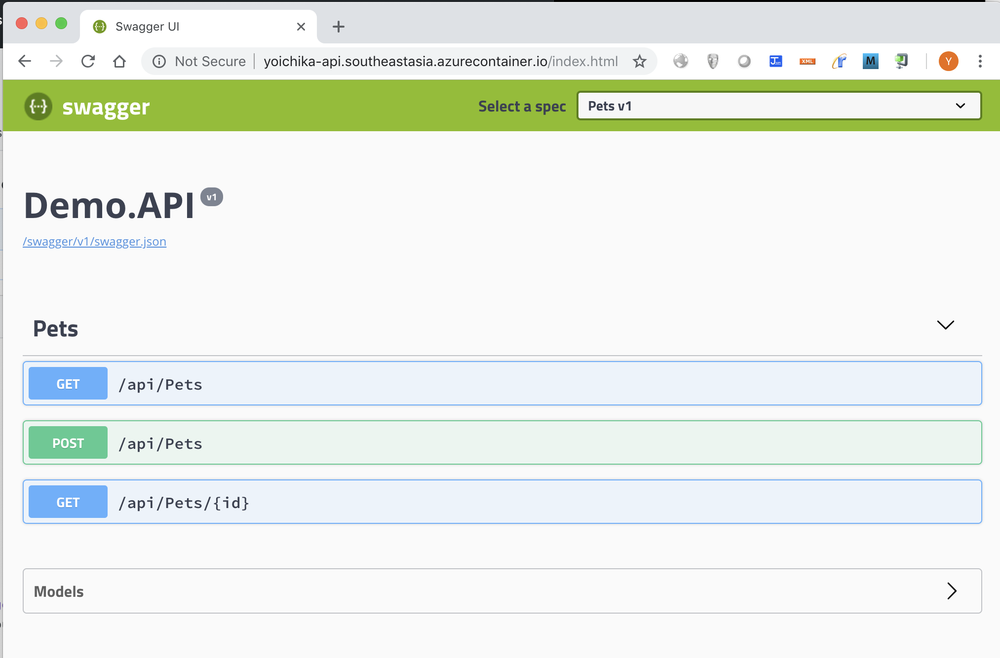

# Quickstart Azure Container Instances (ACI) - Running API in ACI


## Regsiter ACI service provider

Check the status of the ACI provider
```sh
az provider list --query "[?contains(namespace,'Microsoft.ContainerInstance')]" -o table
```

If the provider shows as NotRegistered, register the provider as shown in the following example:
```sh
az provider register --namespace Microsoft.ContainerInstance
```

## Deploy API Container In ACI

First create resource group for this lab. Please note that `region` needs to be the following ACI available regions:
> westus,eastus,westeurope,westus2,northeurope,southeastasia,eastus2,centralus,australiaeast,southcentralus,centralindia,canadacentral

```sh
RESOURCE_GROUP="RG-apim"
REGION="southeastasia"

az group create -n $RESOURCE_GROUP -l $REGION
```

Then, create API in Azure Container Instance

```sh
PREFIX="yoichika"
az container create --name "${PREFIX}-api" \
  --resource-group $RESOURCE_GROUP \
  --image "danielscholl/demoapi" \
  --dns-name-label "${PREFIX}-api" \
  --ports 80
```

## Access Test

```sh
open "http://${PREFIX}-api.${REGION}.azurecontainer.io/index.html"
```

