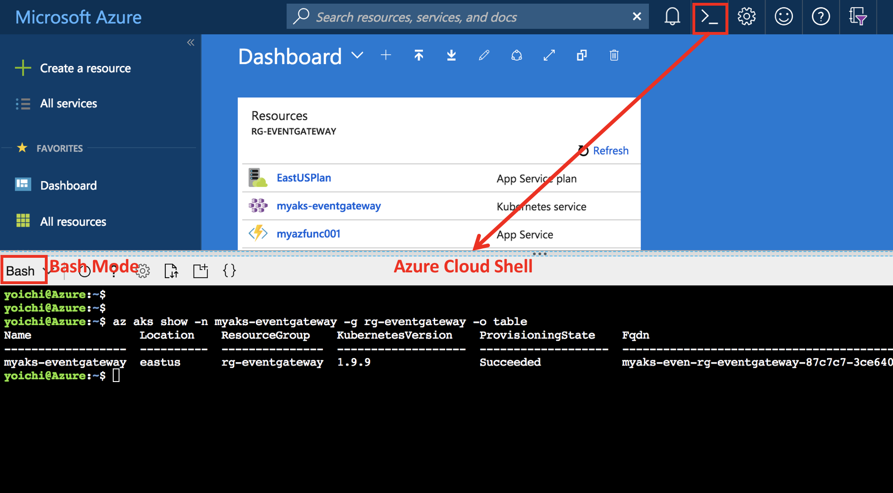
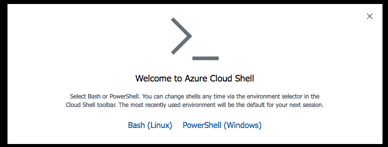
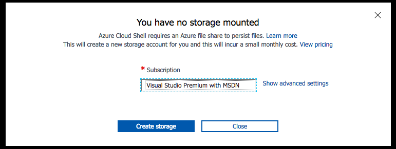

# AKS100: Setup Lab environment

## Open Azure Cloud Shell

In this hands-on labs, you're running this workthrough on [Azure Cloud Shell Bash](https://docs.microsoft.com/en-us/azure/cloud-shell/overview).

So open Azure Cloud Shell with `Base Mode`, first of all.


> Note: Another option is to use the full screen Azure Cloud Shell at https://shell.azure.com/.

The first time you connect to the Azure Cloud Shell you will be prompted to setup an Azure File Share that you will persist the environment.


Click the "Bash (Linux)" option, and select the Azure Subscription and click "Create storage":


After a few seconds, your storage account will be created. Azure Cloud Shell is ready to use


## Verify Subscription

Run the command az account list -o table
```
$ az account list -o table

Name                             CloudName    SubscriptionId                        State    IsDefault
-------------------------------  -----------  ------------------------------------  -------  -----------
Visual Studio Premium with MSDN  AzureCloud   xxxxxxxxxx-xxxx-xxxx-xxxx-xxxxxxxxxx  Enabled  True
Another sub1                     AzureCloud   xxxxxxxxxx-xxxx-xxxx-xxxx-xxxxxxxxxx  Enabled  False
Another sub2                     AzureCloud   xxxxxxxxxx-xxxx-xxxx-xxxx-xxxxxxxxxx  Enabled  False
Another sub3                     AzureCloud   xxxxxxxxxx-xxxx-xxxx-xxxx-xxxxxxxxxx  Enabled  False
```

If you have more than subscription, make sure that subscription is set as default using the subscription name:

```
$ az account set -s 'Visual Studio Premium with MSDN'
```

## Register Azure Resource Providers

Check the following Azure resource providers are already registered:
```sh
# Microsoft.Network
$ az provider list --query "[?contains(namespace,'Microsoft.Network')]" -o table

Namespace          RegistrationState
-----------------  -------------------
Microsoft.Network  Registered

# Microsoft.Storage
$ az provider list --query "[?contains(namespace,'Microsoft.Storage')]" -o table

Namespace          RegistrationState
-----------------  -------------------
Microsoft.Storage  Registered

# Microsoft.Compute
$ az provider list --query "[?contains(namespace,'Microsoft.Compute')]" -o table

Namespace          RegistrationState
-----------------  -------------------
Microsoft.Compute  Registered

# Microsoft.ContainerService
$ az provider list --query "[?contains(namespace,'Microsoft.ContainerService')]" -o table
Namespace                   RegistrationState
--------------------------  -------------------
Microsoft.ContainerService  Registered
```

If the provider shows as `NotRegistered`, register the provider using commands as shown in the following example:

```sh
# if Microsoft.Network is NotRegistered
$ az provider register -n Microsoft.Network

# if Microsoft.Storage is NotRegistered
$ az provider register -n Microsoft.Storage

# if Microsoft.Compute is NotRegistered
$ az provider register -n Microsoft.Compute

# if Microsoft.ContainerService is NotRegistered
$ az provider register -n Microsoft.ContainerService
```

---
[Top](../README.md) | [Next](aks-101-create-aks-cluster.md)
