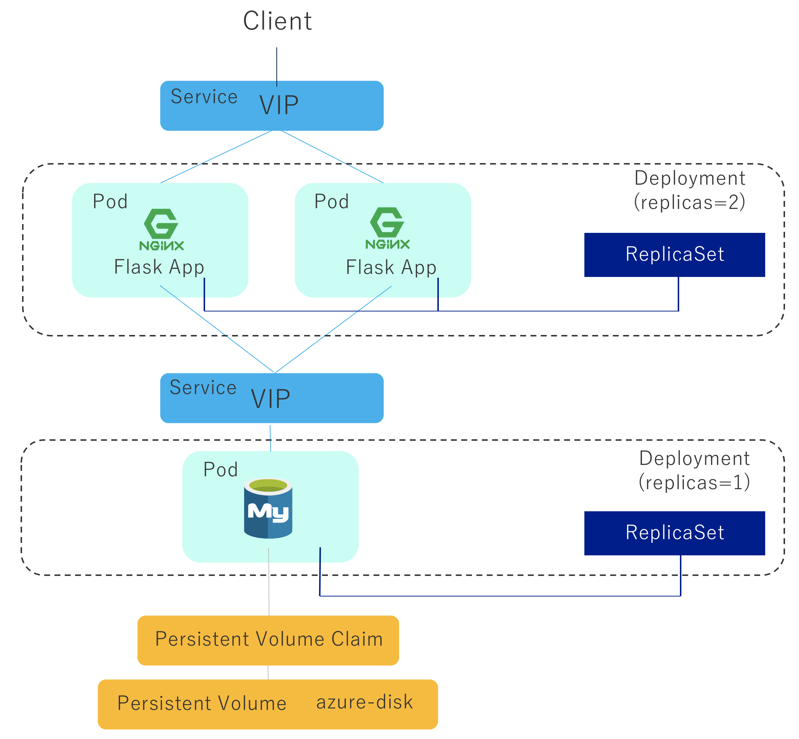

# AKS103: Deploy the Voting App to AKS Cluster

<!-- TOC -->
- [AKS103: Deploy the Voting App to AKS Cluster](#aks103-deploy-the-voting-app-to-aks-cluster)
  - [Clone the Github repo (only if you haven't done yet)](#clone-the-github-repo-only-if-you-havent-done-yet)
  - [Review/Edit the YAML Config Files](#reviewedit-the-yaml-config-files)
  - [Deploy the Voting App to AKS Cluster](#deploy-the-voting-app-to-aks-cluster)
    - [Create ConfigMap](#create-configmap)
    - [Create Storage Resource](#create-storage-resource)
    - [Create Secret Resource](#create-secret-resource)
      - [[NOTE] How to check secret info in your Secret resource](#note-how-to-check-secret-info-in-your-secret-resource)
    - [Create Deployment](#create-deployment)
    - [Create Service](#create-service)
    - [Access service in the cluster by port-forward](#access-service-in-the-cluster-by-port-forward)


In this module, you will deploy the voting app (below) to the AKS cluster that you created in the previous secion - [AKS101: Create Azure Kubernetes Services(AKS) Cluster](aks-101-create-aks-cluster.md). 




## Clone the Github repo (only if you haven't done yet)

Clone the workshop repo
```sh
$ git clone https://github.com/yokawasa/azure-container-labs.git
```

Then, change directory to the repository

```
$ cd azure-container-labs
$ ls

apps  assets  charts  kubernetes-manifests  labs  LICENSE  README.md  scripts
```


## Review/Edit the YAML Config Files

If you succeeded to have a container image registered in the registry, replace the container image part of `kubernetes-manifests/vote/deployment.yaml` file with your container image:tag name.
Of course, You can use a default container image (yoichikawasaki/azure-vote-front) for the front app, and (yoichikawasaki/azure-vote-back) for the backend (mysql).

| Type | Default image in Docker Hub | new image  registerd in ACR |
| ------------- | ------------- | ------------- |
| Frontend  | yoichikawasaki/azure-vote-front:1.0.0 | {acrname}.azurecr.io/azure-vote-front:1.0.0 |
| Backend   | yoichikawasaki/azure-vote-back:1.0.0 | {acrname}.azurecr.io/azure-vote-back:1.0.0 |

Open `kubernetes-manifests/vote/deployment.yaml` and replace the container image

```yaml
apiVersion: apps/v1beta1
kind: Deployment
metadata:
  name: azure-voting-app-back
  labels:
    app: azure-voting-app
    component: azure-voting-app-back
spec:
  replicas: 1
  template:
    metadata:
      labels:
        app: azure-voting-app
        component: azure-voting-app-back
    spec:
      containers:
      - name: azure-voting-app-back
        image: yoichikawasaki/azure-vote-back:1.0.0   <<<<< <acrname>.azurecr.io/azure-vote-back:1.0.0
        args: ["--ignore-db-dir=lost+found"]
        ...
---
apiVersion: apps/v1beta1
kind: Deployment
metadata:
  name: azure-voting-app-front
  labels:
    app: azure-voting-app
    component: azure-voting-app-front
spec:
  replicas: 2
  template:
    metadata:
      labels:
        app: azure-voting-app
        component: azure-voting-app-front
    spec:
      containers:
      - name: azure-voting-app-front
        image: yoichikawasaki/azure-vote-front:1.0.0  <<<<<  <acrname>.azurecr.io/azure-vote-back:1.0.0
        resources:
        ...
```

## Deploy the Voting App to AKS Cluster

### Create ConfigMap
```sh
$ kubectl apply -f kubernetes-manifests/vote/configmap.yaml

configmap "azure-voting-app-config" created
```

Get ConfigMap list with the following command and confirm that `azure-voting-app-config` configmap resource is in the list
```sh
$ kubectl get configmap

NAME                      DATA      AGE
azure-voting-app-config   1         50s
```

### Create Storage Resource

```sh
$ kubectl apply -f kubernetes-manifests/vote/pvc.yaml

storageclass "azure-disk-standard" created
persistentvolumeclaim "azure-voting-app-pv-claim" created
```

Get PVC info list with the following command and confirm that `azure-voting-app-pv-claim` PVC resource's status is `Bound`
```
$ kubectl get pvc

NAME                        STATUS    VOLUME                                     CAPACITY   ACCESS MODES   STORAGECLASS          AGE
azure-voting-app-pv-claim   Bound     pvc-43382768-9eaa-11e8-b7d0-de454880a5dc   1Gi        RWO            azure-disk-standard   1m
```

### Create Secret Resource

Create Secret resource with the following command
```
$ kubectl apply -f kubernetes-manifests/vote/secret.yaml

secret "azure-voting-app-secret" created
```

#### [NOTE] How to check secret info in your Secret resource

Get Secret list with the following command
```sh
$ kubectl get secrets

NAME                      TYPE                                  DATA      AGE
azure-voting-app-secret   Opaque                                5         1m
default-token-stzr8       kubernetes.io/service-account-token   3         11d
```

Get the detail of Secret resource `azure-voting-app-secret`

```sh 
$ kubectl get secrets azure-voting-app-secret -o yaml

apiVersion: v1
data:
  MYSQL_DATABASE: YXp1cmV2b3Rl
  MYSQL_HOST: YXp1cmUtdm90aW5nLWFwcC1iYWNrCg==
  MYSQL_PASSWORD: UGFzc3dvcmQxMg==
  MYSQL_ROOT_PASSWORD: UGFzc3dvcmQxMg==
  MYSQL_USER: ZGJ1c2Vy
kind: Secret
metadata:
  annotations:
    kubectl.kubernetes.io/last-applied-configuration: |
      {"apiVersion":"v1","data":{"MYSQL_DATABASE":"YXp1cmV2b3Rl","MYSQL_HOST":"YXp1cmUtdm90ZS1iYWNr","MYSQL_PASSWORD":"UGFzc3dvcmQxMg==","MYSQL_ROOT_PASSWORD":"UGFzc3dvcmQxMg==","MYSQL_USER":"ZGJ1c2Vy"},"kind":"Secret","metadata":{"annotations":{},"labels":{"app":"azure-voting-app"},"name":"azure-voting-app-secret","namespace":"default"},"type":"Opaque"}
  creationTimestamp: 2018-08-13T03:38:02Z
  labels:
    app: azure-voting-app
  name: azure-voting-app-secret
  namespace: default
  resourceVersion: "1275879"
  selfLink: /api/v1/namespaces/default/secrets/azure-voting-app-secret
  uid: 47cd165f-9eaa-11e8-b7d0-de454880a5dc
type: Opaque
```
> Get the output in YAML format with `-o yaml` option
> Secret info is store as Key/Value pair, and each secret value needs to be base64 encoded（For the detail, see [kubenetes.io - Secrets](https://kubernetes.io/docs/concepts/configuration/secret/)）

As each Secret value is base64 encoded, it needs to be base64 decoded to look up its context (ie. MYSQL_PASSWORD）
```sh
$ echo "UGFzc3dvcmQxMg==" | base64 --decode

Password12
```

### Create Deployment
Create Deployment resource with the following command
```
$ kubectl apply -f kubernetes-manifests/vote/deployment.yaml

deployment "azure-voting-app-back" created
deployment "azure-voting-app-front" created
```

Get Pod info list and confirm that all created Pods' status are `Running`

```sh
kubectl get pod -w

NAME                                READY     STATUS              RESTARTS   AGE
azure-voting-app-back-75b9bbc874-8wx6p    0/1       ContainerCreating   0          1m
azure-voting-app-front-86694fdcb4-5jjsm   0/1       ContainerCreating   0          1m
azure-voting-app-front-86694fdcb4-t6pg6   0/1       ContainerCreating   0          1m
azure-voting-app-back-75b9bbc874-8wx6p    1/1       Running   0         1m
azure-voting-app-front-86694fdcb4-5jjsm   1/1       Running   0         2m
azure-voting-app-front-86694fdcb4-t6pg6   1/1       Running   0         2m
```
> Option `-w` can watch for changes after listing/getting the requested objects

Get Deployment info list and confirm that the number of `DESIRED` and `AVAILABLE` is same.
```sh
$ kubectl get deploy

NAME                     DESIRED   CURRENT   UP-TO-DATE   AVAILABLE   AGE
azure-voting-app-back    1         1         1            1           1m
azure-voting-app-front   2         2         2            2           1m
```

### Create Service

Create Service resource with the following command
```sh
$ kubectl apply -f kubernetes-manifests/vote/service.yaml

service "azure-voting-app-back" created
service "azure-voting-app-front" created
```

Get service list with `kubectl get servcies | kubectl get svc`:

```sh
kubectl get svc

NAME                     TYPE        CLUSTER-IP     EXTERNAL-IP   PORT(S)    AGE
azure-voting-app-back    ClusterIP   10.0.243.95    <none>        3306/TCP   7m11s
azure-voting-app-front   ClusterIP   10.0.179.126   <none>        80/TCP     7m11s
kubernetes               ClusterIP   10.0.0.1       <none>        443/TCP    11d
```

### Access service in the cluster by port-forward

As you can see all services in the cluster doesn't have `EXTERNAL-IP` but `CLUSTER-IP` which mean you can access the service from inside the cluster but not from outside.  
In this section, you access a service in the cluster from outside using `kubectl port-forward` (for more detail on kubectl port-forward, see [this](https://kubernetes.io/docs/tasks/access-application-cluster/port-forward-access-application-cluster/)).

Open one terminal, and port forward your local port to a Kubernetes service using `kubectl port-forward` like this

> Port forward local 8080 port to azure-voting-app-front service port 80 in Kubernetes cluster
```sh
# kubectl port-forward svc/<target-service-name> <local-port>:<target-port>
kubectl port-forward svc/azure-voting-app-front 8080:80

Forwarding from 127.0.0.1:8080 -> 80
Forwarding from [::1]:8080 -> 80
```

NOTE: an external IP can be obtained by using `-o jsonpath` option like this:
```
EXTERNALIP=$(kubectl get svc azure-voting-app-front -o jsonpath='{.status.loadBalancer.ingress[0].ip}')
echo $EXTERNALIP
```

Then, you can access the service by accessing localhost:8080 
```
open http://localhost:8080
```


---
[Top](../README.md) | [Back](aks-102-acr.md) | [Next](aks-104-ingress.md)
