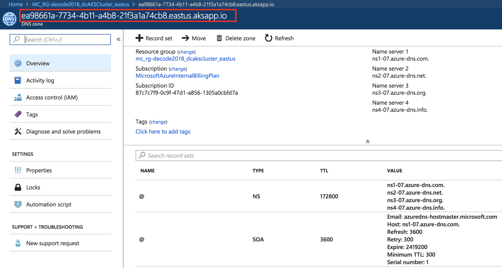
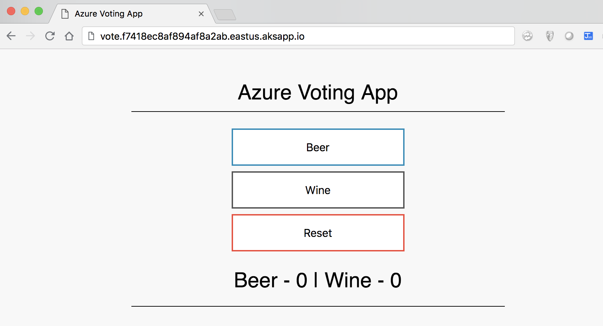

# AKS104:  Ingress Controllers - HTTP application routing

<!-- TOC -->
- [AKS104: Ingress Controllers - HTTP application routing](#aks104-ingress-controllers---http-application-routing)
  - [Setup HTTP Application Routing](#setup-http-application-routing)
  - [Extra labs - NGINX Ingress Controller](#extra-labs---nginx-ingress-controller)

An ingress controller is a piece of software that provides reverse proxy, configurable traffic routing, and TLS termination for Kubernetes services. Kubernetes ingress resources are used to configure the ingress rules and routes for individual Kubernetes services. Using an ingress controller and ingress rules, a single IP address can be used to route traffic to multiple services in a Kubernetes cluster. 

In this module, you configure the `HTTP application routing` and make your app accessible via the the HTTP application routing.


## Setup HTTP Application Routing

The HTTP application routing solution makes it easy to access applications that are deployed to your Azure Kubernetes Service (AKS) cluster. it configures an Ingress controller in your AKS cluster. As applications are deployed, the solution also creates publically accessible DNS names for application endpoints (it actually creates a DNS Zone in your subscription). In creating AKS cluster in the [aks-101 module](aks-101-create-aks-cluster.md), you already enabled the `HTTP application routing solution`. So you're ready to use the HTTP application routing. For more on HTTP application routing, please refer to [this](https://docs.microsoft.com/en-us/azure/aks/http-application-routing).


First of all, browse to the auto-created AKS resource group named `MC_<ResourceGroup>_<ClusterName>_<region>` and select the DNS zone. Take note of the DNS zone name. This name is needed in next strep.



Then, open `kubernetes-manifests/vote/ingress.yaml` and replace `<CLUSTER_SPECIFIC_DNS_ZONE>` with the DNS zone that you obtained

```yaml
apiVersion: extensions/v1beta1
kind: Ingress
metadata:
  name: azure-voting-app
  labels:
    app: azure-voting-app
  annotations:
    kubernetes.io/ingress.class: addon-http-application-routing
spec:
  rules:
  - host: vote.<CLUSTER_SPECIFIC_DNS_ZONE>
    http:
      paths:
      - backend:
          serviceName: azure-voting-app-front
          servicePort: 80
        path: /
```

Then, deploy the ingress

```sh
$ kubectl apply -f kubernetes-manifests/vote/ingress.yaml

ingress.extensions/azure-voting-app created
```

Check if the ingress is actually created
```sh
$ kubectl get ingress -w

NAME           HOSTS                                                   ADDRESS   PORTS     AGE
azure-vote     vote.f7418ec8af894af8a2ab.eastus.aksapp.io                     80        1m
```

Finally, you can access the app with the URL - `http://vote.<CLUSTER_SPECIFIC_DNS_ZONE>`




## Extra labs - NGINX Ingress Controller

To try `NGINX Ingress Controller`, see the following project pages:

- [NGINX ingress controller](https://github.com/kubernetes/ingress-nginx)
- [How to deploy the NGINX ingress controller in AKS](https://docs.microsoft.com/en-us/azure/aks/ingress-basic)
- [Helm CLI](https://docs.microsoft.com/en-us/azure/aks/kubernetes-helm)


---
[Top](../README.md) | [Back](aks-103-deploy-app.md) | [Next](aks-105-scaleout.md)
