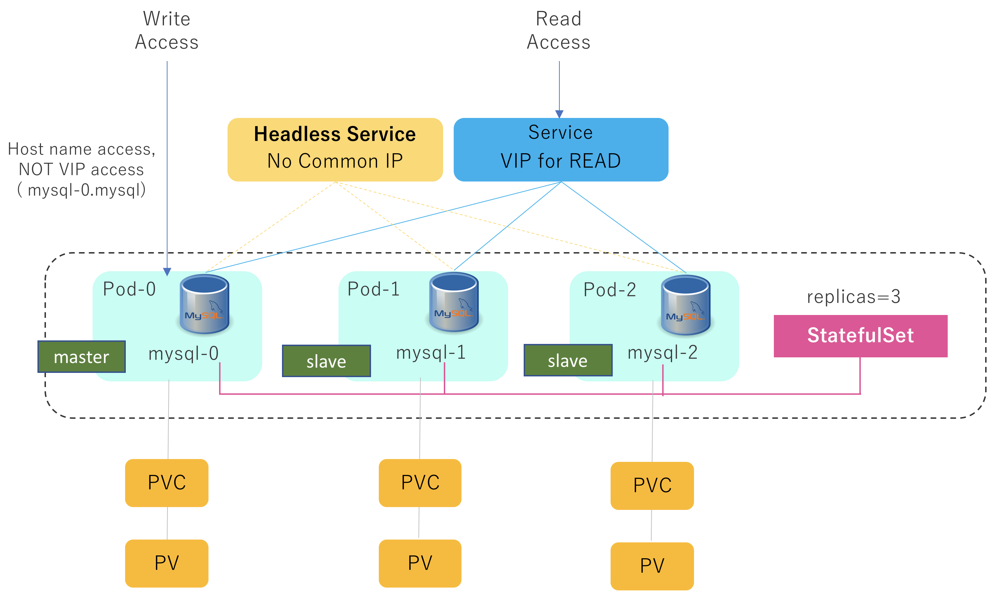

# AKS106: Deploy Replicated MySQL Topology with Stateful Sets

Table of Content
<!-- TOC -->
- [AKS106: Deploy Replicated MySQL Topology with Stateful Sets](#aks106-deploy-replicated-mysql-topology-with-stateful-sets)
  - [Deploy HA MySQL](#deploy-ha-mysql)
    - [Create StorageClass (Azure Disk)](#create-storageclass-azure-disk)
    - [Create ConfigMap](#create-configmap)
    - [Create Services](#create-services)
    - [Create StatefulSet](#create-statefulset)


In this module, you will setup a replicated stateful MySQL HA cluster using a `StatefulSet` controller. It is a MySQL single-master topology with multiple slaves running asynchronous replication.



## Deploy HA MySQL

### Create StorageClass (Azure Disk)

```sh
$ kubectl apply -f kubernetes-manifests/mysql-repl/mysql-storage.yaml

storageclass "my-mysql-ha" created
```
Then, get StorageClass info and StorageClass named `my-mysql-ha` is created

```sh
$ kubectl get sc

NAME                  PROVISIONER                AGE
azure-disk-standard   kubernetes.io/azure-disk   4h
default (default)     kubernetes.io/azure-disk   22h
managed-premium       kubernetes.io/azure-disk   22h
my-mysql-ha           kubernetes.io/azure-disk   29s
```

### Create ConfigMap

Create ConfigMap to control MySQL configuration: 

```sh 
$ kubectl apply -f kubernetes-manifests/mysql-repl/mysql-configmap.yaml

configmap "mysql" created
```

Get ConfigMap info list and confirm that ConfigMap named `mysql` is created

```sh 
$ kubectl get configmap

NAME                      DATA      AGE
azure-voting-app-config   1         4h
mysql                     2         8s     <<<< added
```

### Create Services

Create two headless services using the following configuration:

```sh
$ kubectl apply -f kubernetes-manifests/mysql-repl/mysql-services.yaml

service "mysql" created
service "mysql-read" created
```

Get Service info list, and confirm servcies named `mysql` and `mysql-read` are created

```sh
$ kubectl get svc -l app=mysql

NAME         TYPE        CLUSTER-IP     EXTERNAL-IP   PORT(S)    AGE
mysql        ClusterIP   None           <none>        3306/TCP   19m
mysql-read   ClusterIP   10.0.144.173   <none>        3306/TCP   19m
```

Only read queries can use the load-balanced mysql-read service. Because there is only one MySQL master, clients should connect directly to the MySQL master Pod, identified by `mysql-0.mysql`, to execute writes.

### Create StatefulSet

Create StatefulSet with the following command:

```sh
$ kubectl apply -f kubernetes-manifests/mysql-repl/mysql-statefulset.yaml

statefulset "mysql" created
```
```
$kubectl get pvc -l app=mysql -w

NAME           STATUS    VOLUME                                     CAPACITY   ACCESS MODES   STORAGECLASS   AGE
data-mysql-0   Bound     pvc-fe454f94-bd4e-11e8-a573-5ac50f7db2aa   1Gi        RWO            my-mysql-ha    28s
```

Get Pod info list and confirm that all created Pods' status are `Running`

```
$ kubectl get pods -l app=mysql -w

NAME      READY     STATUS     RESTARTS   AGE
mysql-0   0/2       Init:0/2   0          47s
mysql-0   0/2       Init:1/2   0         47s
mysql-0   0/2       PodInitializing   0         1m
mysql-0   1/2       Running   0         1m
mysql-0   2/2       Running   0         1m
mysql-1   0/2       Pending   0         0s
mysql-1   0/2       Pending   0         0s
mysql-1   0/2       Pending   0         12s
mysql-1   0/2       Init:0/2   0         12s
mysql-1   0/2       Init:1/2   0         59s
mysql-1   0/2       Init:1/2   0         1m
mysql-1   0/2       PodInitializing   0         1m
mysql-1   1/2       Running   0         1m
mysql-1   2/2       Running   0         1m
mysql-2   0/2       Pending   0         0s
mysql-2   0/2       Pending   0         0s
mysql-2   0/2       Pending   0         17s
mysql-2   0/2       Init:0/2   0         17s
mysql-2   0/2       Init:1/2   0         1m
mysql-2   0/2       Init:1/2   0         1m
mysql-2   0/2       PodInitializing   0         1m
mysql-2   1/2       Running   0         1m
mysql-2   2/2       Running   0         1m
```

Get StatefulSet info list, and  confirm that the number of `DESIRED` and `AVAILABLE` is same.

```sh
$ kubectl get statefulsets

NAME      DESIRED   CURRENT   AGE
mysql     3         3         6m
```


---
[Top](../README.md) | [Back](aks-105-scaleout.md) | [Next](aks-107-container-insights.md)
