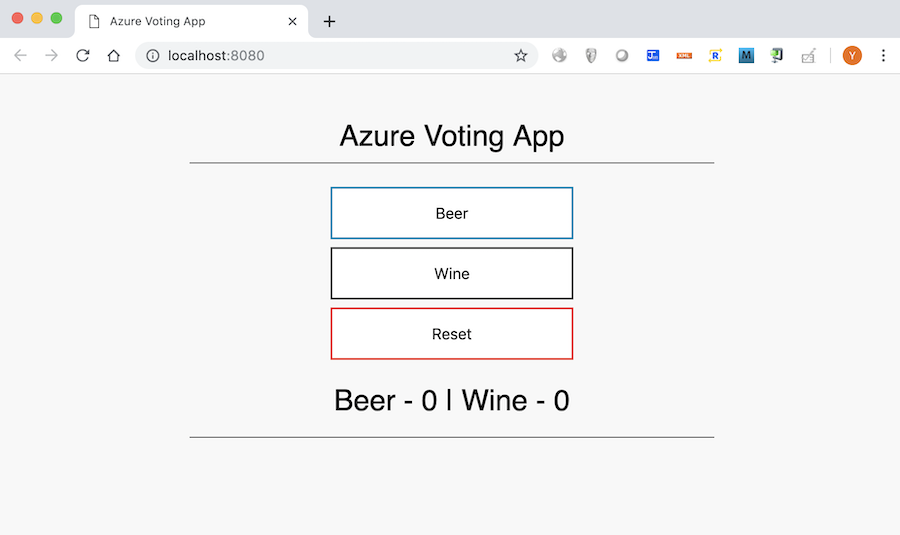

# AKS201 - Provision, bind and consume Azure Database for PostgreSQL using OSBA

## Install Open Service Broker for Azure

Open Service Broker for Azure (OSBA) is the open source, Open Service Broker-compatible API server that provisions managed services in Azure. As prerequisites, you need to install Service Catalog onto your Kubernetes cluster.

### Install Helm Client and Tiller (only if not yet installed)

If you haven't installed Helm CLI and Tiller, please go through the following 2 steps:
- [Install Helm CLI (only if not installed yet)](aks-108-helm.md#install-helm-cli-only-if-not-installed-yet)
- [Create a service account (only for RBAC-enabled AKS cluster)](aks-108-helm.md#create-a-service-account-only-for-rbac-enabled-aks-cluster)

### Install Service Catalog using Helm Chart

Add the Service Catalog chart to the Helm repository
```
helm repo add svc-cat https://svc-catalog-charts.storage.googleapis.com
```

Grant Helm permission to admin your cluster, so it can install service-catalog:
```
kubectl create clusterrolebinding tiller-cluster-admin \
    --clusterrole=cluster-admin \
    --serviceaccount=kube-system:default
```

Install service catalog with Helm chart
```
helm install svc-cat/catalog \
    --name catalog \
    --namespace catalog
```

Check if it's deployed.
echo "Wait until servicecatalog appears in the output of \"kubectl get apiservice\""
```
helm ls  
# or 'helm ls --all catalog'
```
Verify that `servicecatalog` appears in the output of "kubectl get apiservice"
```
kubectl get apiservice -w
```
Sample Output:

```
NAME                                    AGE
v1.                                     21d
v1.apps                                 21d
v1.authentication.k8s.io                21d
v1.authorization.k8s.io                 21d
v1.autoscaling                          21d
v1.batch                                21d
v1.networking.k8s.io                    21d
v1.rbac.authorization.k8s.io            21d
v1.storage.k8s.io                       21d
v1alpha1.admissionregistration.k8s.io   16d
v1alpha2.config.istio.io                21d
v1beta1.admissionregistration.k8s.io    21d
v1beta1.apiextensions.k8s.io            21d
v1beta1.apps                            21d
v1beta1.authentication.k8s.io           21d
v1beta1.authorization.k8s.io            21d
v1beta1.batch                           21d
v1beta1.certificates.k8s.io             21d
v1beta1.events.k8s.io                   21d
v1beta1.extensions                      21d
v1beta1.policy                          21d
v1beta1.rbac.authorization.k8s.io       21d
v1beta1.servicecatalog.k8s.io           4d      <<<< This one!!
v1beta1.storage.k8s.io                  21d
v1beta2.apps                            21d
v2beta1.autoscaling                     21d
```

In additioin, check Service Catalog Pods' running status:
```
kubectl get pods --namespace catalog

(Output Example)
NAME                                                     READY     STATUS    RESTARTS   AGE
po/catalog-catalog-apiserver-5999465555-9hgwm            2/2       Running   4          9d
po/catalog-catalog-controller-manager-554c758786-f8qvc   1/1       Running   11         9d
```

Refer to [Install Service Catalog](https://docs.microsoft.com/en-us/azure/aks/integrate-azure#install-service-catalog) for more detail on Service Catalog installation.

### Install Service Catalog CLI

Service Catalog (svcat) CLI is very useful CLI tool in managing Service Catalog. 

```
curl -sLO https://servicecatalogcli.blob.core.windows.net/cli/latest/$(uname -s)/$(uname -m)/svcat

# Make the binary executable
chmod +x ./svcat

# Move the binary to a directory on your PATH (e.g., $HOME/bin)
mv svcat $HOME/bin
```

Refer to [Installing the Service Catalog CLI](https://github.com/kubernetes-incubator/service-catalog/blob/master/docs/install.md#installing-the-service-catalog-cli) for more detail on Service Catalog CLI installation.

### Install Open Service Broker for Azure (OSBA) using Helm Chart

Get your service principal that you created in [the preparation step](00-preparations.md) and use them for either `AZURE_CLIENT_ID`, `AZURE_CLIENT_SECRET`, `AZURE_TENANT_ID` variable value below, then install OSBA using Helm chart like this below:

```
AZURE_CLIENT_ID='Your Service Principal Client ID'
AZURE_CLIENT_SECRET='Your Service Principal Client Secret'
AZURE_TENANT_ID='Your Service Principal Tenant ID'

AZURE_SUBSCRIPTION_ID=$(az account show --query id --output tsv | sed -e "s/[\r\n]\+//g" )

helm repo add azure https://kubernetescharts.blob.core.windows.net/azure

helm install azure/open-service-broker-azure --name osba --namespace osba \
    --set azure.subscriptionId=$AZURE_SUBSCRIPTION_ID \
    --set azure.tenantId=$AZURE_TENANT_ID \
    --set azure.clientId=$AZURE_CLIENT_ID \
    --set azure.clientSecret=$AZURE_CLIENT_SECRET
```

Check if OSBA Pods are ready and running:
```
kubectl get pods --namespace osba -w

(Output Example)
NAME                                           READY     STATUS    RESTARTS   AGE
po/osba-azure-service-broker-8495bff484-7ggj6   1/1       Running   0          9d
po/osba-redis-5b44fc9779-hgnck
```


Refer to [Install Open Service Broker for Azure](https://docs.microsoft.com/en-us/azure/aks/integrate-azure#install-open-service-broker-for-azure) for more detail on OSBA installation


## Provision and bind Azure Database for MySQL using OSBA

### Provision an instance of the MySQL Service

First of all, open `kubernetes-manifests/vote-sb/mysql-instance.yaml` and make sure if `location` and `resourceGroup` parameters are the same as the one you careated for AKS cluster
```yaml
apiVersion: servicecatalog.k8s.io/v1beta1
kind: ServiceInstance
metadata:
  name: my-osba-mysql-instance
  namespace: default
spec:
  clusterServiceClassExternalName: azure-mysql-5-7
  clusterServicePlanExternalName: general-purpose
  parameters:
    location: japaneast                <<< HERE
    resourceGroup: RG_azconlab         <<< HERE
    sslEnforcement: disabled
    firewallRules:
    - name: "AllowFromAzure"
      startIPAddress: "0.0.0.0"
      endIPAddress: "0.0.0.0"
    #- name: AllowAll
    #  startIPAddress: 0.0.0.0
    #  endIPAddress: 255.255.255.255
    cores: 2
    storage: 5
    backupRetention: 7
```

Then, run the following command to create MySQL instance
```sh
$ kubectl create -f kubernetes/vote-sb/mysql-instance.yaml
```

You can get MySQL's provisioning status via `svcat` command: 
```sh
$ svcat get instances

           NAME            NAMESPACE        CLASS             PLAN         STATUS
+------------------------+-----------+-----------------+-----------------+--------+
  my-osba-mysql-instance   default     azure-mysql-5-7   general-purpose   Provisitoning 
```

The status above is `Provisioning`. Please wait until the status changes to `Ready`.

### Bind the instance of the MySQL Service

Here is the YAML file to bind the instance of the MySQL Service - `kubernetes-manifests/vote-sb/mysql-binding.yaml`.

```yaml
apiVersion: servicecatalog.k8s.io/v1beta1
kind: ServiceBinding
metadata:
  name: my-osba-mysql-binding
  namespace: default
spec:
  instanceRef:
    name: my-osba-mysql-instance
  secretName: my-osba-mysql-secret
```

Run the following command to bind MySQL instance
```
$ kubectl create -f kubernetes/vote-sb/mysql-binding.yaml
```
> After binding, the final step involves mapping the connection credentials and service-specific information into the application. These pieces of information are stored in secret (named `my-osba-mysql-secret` in this case) that the application in the cluster can access and use to connect directly with the managed service. To understand more, please dump the secret and see all credential information stored in the secret:
> ```
> $ kubectl get secret my-osba-mysql-secret -o yaml
>
>   apiVersion: v1
>   data:
>    database: Y3hjbGJyYWIzYw==
>    host: YTdkNjhkOTUtYzY0My00MTI1LWIyOTUtMTMxODMyZTMxYmI2Lm15c3FsLmRhdGFiYXNlLmF6dXJlLmNvbQ==
>    password: encwVnF6V0lpbEtQU256TQ==
>    port: MzMwNg==
>    sslRequired: ZmFsc2U=
>    tags: WyJteXNxbCJd
>    uri: bXlzcWw6Ly9lb2swOWd2aWRoJTQwYTdkNjhkOTUtYzY0My00MTI1LWIyOTUtMTMxODMyZTMxYmI2Onp3MFZxeldJaWxLUFNuek1AYTdkNjhkOTUtYzY0My00MTI1LWIyOTUtMTMxODMyZTMxYmI2Lm15c3FsLmRhdGFiYXNlLmF6dXJlLmNvbTozMzA2L2N4Y2xicmFiM2M/dXNlU1NMPXRydWUmcmVxdWlyZVNTTD10cnVl
>    username: ZW9rMDlndmlkaEBhN2Q2OGQ5NS1jNjQzLTQxMjUtYjI5NS0xMzE4MzJlMzFiYjY=
>    kind: Secret
> ```


## Deploy Application to AKS cluster (OSBA version)

### Create ConfigMap
```sh
$ kubectl apply -f kubernetes-manifests/vote-sb/configmap.yaml

configmap "azure-voting-app-config" created
```

Get ConfigMap list with the following command and confirm that `azure-voting-app-config` configmap resource is in the list
```sh
$ kubectl get configmap

NAME                      DATA      AGE
azure-voting-app-config   1         50s
```

### Create Deployment
Create Deployment resource with the following command
```
$ kubectl apply -f kubernetes-manifests/vote-sb/deployment.yaml

deployment "azure-voting-app-back" created
deployment "azure-voting-app-front" created
```

Get Pod info list and confirm that all created Pods' status are `Running`

```sh
kubectl get pod -w

NAME                                READY     STATUS              RESTARTS   AGE
azure-voting-app-back-75b9bbc874-8wx6p    0/1       ContainerCreating   0          1m
azure-voting-app-front-86694fdcb4-5jjsm   0/1       ContainerCreating   0          1m
azure-voting-app-front-86694fdcb4-t6pg6   0/1       ContainerCreating   0          1m
azure-voting-app-back-75b9bbc874-8wx6p    1/1       Running   0         1m
azure-voting-app-front-86694fdcb4-5jjsm   1/1       Running   0         2m
azure-voting-app-front-86694fdcb4-t6pg6   1/1       Running   0         2m
```
> Option `-w` can watch for changes after listing/getting the requested objects

Get Deployment info list and confirm that the number of `DESIRED` and `AVAILABLE` is same.
```sh
$ kubectl get deploy

NAME                     DESIRED   CURRENT   UP-TO-DATE   AVAILABLE   AGE
azure-voting-app-back    1         1         1            1           1m
azure-voting-app-front   2         2         2            2           1m
```

### Create Service

Create Service resource with the following command
```sh
$ kubectl apply -f kubernetes-manifests/vote-sb/service.yaml

service "azure-voting-app-front" created
```

Get Service info list. Wait until an external IP for `azure-voting-app-front` is assigned in`EXTERNAL-IP` field

```sh
kubectl get svc -w

NAME                     TYPE           CLUSTER-IP     EXTERNAL-IP   PORT(S)        AGE
azure-voting-app-front   LoadBalancer   10.0.45.202    <pending>     80:32125/TCP   33s
kubernetes               ClusterIP      10.0.0.1       <none>        443/TCP        11d
azure-voting-app-front   LoadBalancer   10.0.45.202   40.115.180.143   80:32125/TCP   45s
```
> Option `-w` can watch for changes after listing/getting the requested objects

Access the service with an assigned external IP
```
curl 40.115.180.143    << an assigned external IP
```

NOTE: an external IP can be obtained by using `-o jsonpath` option like this:
```
EXTERNALIP=$(kubectl get svc azure-voting-app-front -o jsonpath='{.status.loadBalancer.ingress[0].ip}')
echo $EXTERNALIP
```




## Useful Links
- [Installing Helm](https://docs.helm.sh/using_helm/#installing-helm)
- [Install Service Catalog](https://docs.microsoft.com/en-us/azure/aks/integrate-azure#install-service-catalog)
- [Install Open Service Broker for Azure](https://docs.microsoft.com/en-us/azure/aks/integrate-azure#install-open-service-broker-for-azure)
- [Parametes of Broker for Azure Database for PostgreSQL](https://github.com/Azure/open-service-broker-azure/blob/master/docs/modules/postgresql.md)
- [Azure Database for PostgreSQL](https://azure.microsoft.com/en-us/services/postgresql/)

---
[Top](../README.md) | [Next](aks-202-istio-top.md)
