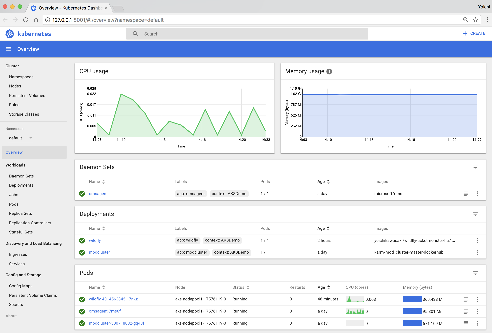

# Manage AKS and ACR using azure-cli

<!-- TOC -->

- [Manage AKS and ACR using azure-cli](#manage-aks-and-acr-using-azure-cli)
  - [Manage AKS (Azure Kubernetes Service)](#manage-aks-azure-kubernetes-service)
    - [Get the list of AKS cluster](#get-the-list-of-aks-cluster)
    - [Browse Kubernete dashboard with AKS](#browse-kubernete-dashboard-with-aks)
    - [Get the details of an AKS](#get-the-details-of-an-aks)
    - [Get available Kubernetes version in your region](#get-available-kubernetes-version-in-your-region)
    - [Upgrde AKS Cluster](#upgrde-aks-cluster)
    - [Scale AKS Cluster Nodes](#scale-aks-cluster-nodes)
  - [Manage ACR (Azure Container Registry)](#manage-acr-azure-container-registry)
    - [Check ACR Name availability](#check-acr-name-availability)
    - [Create ACR](#create-acr)
    - [Get ACR list](#get-acr-list)
    - [Get the details of an ACR](#get-the-details-of-an-acr)
    - [ACR Task - Build](#acr-task---build)

<!-- /TOC -->

## Manage AKS (Azure Kubernetes Service)

### Get the list of AKS cluster
> az aks list -o table
Example
```sh
$ az aks list -o table

Name      Location    ResourceGroup    KubernetesVersion    ProvisioningState    Fqdn
--------  ----------  ---------------  -------------------  -------------------  -----------------------------------------------------------
azconlab  japaneast   RG_azconlab      1.11.3               Succeeded            azconlab-rgazconlab-87c7c7-7815a3a8.hcp.japaneast.azmk8s.io
myaks001  eastus   RG_myaks001      1.11.1               Succeeded            azconlab-rgazconlab-zcjbas-681s5a3a8.hcp.eastus.azmk8s.io
```

### Browse Kubernete dashboard with AKS

You can browse Kubernete dashbboard for your AKS cluster with the following command:
```
RESOURCE_GROUP='your resource group (e.g., "RG-aks")'
CLUSTER_NAME='your AKS cluster name (e.g., "myAKSCluster")'

az aks browse --resource-group $RESOURCE_GROUP --name $CLUSTER_NAME
```


If you're using RBAC enabled kubernetes cluster, you need to configure Service Account and RoleBinding in order to make Dashbaord work.
```sh
# Here is a way to give full privilege (role: cluster-admin) to the Dashboard’s Service Account kubernetes-dashboard
$ cat <<EOF | kubectl apply -f -
apiVersion: rbac.authorization.k8s.io/v1beta1
kind: ClusterRoleBinding
metadata:
  name: kubernetes-dashboard
  labels:
    k8s-app: kubernetes-dashboard
roleRef:
  apiGroup: rbac.authorization.k8s.io
  kind: ClusterRole
  name: cluster-admin
subjects:
- kind: ServiceAccount
  name: kubernetes-dashboard
  namespace: kube-system
EOF
```

If you want to configure more granular privilege to the Dashboard's service account instead of giving full privilege(role: cluster-admin), please follow "Option 1: Access to Dashboard with your Service Account" in [this article](https://unofficialism.info/posts/accessing-rbac-enabled-kubernetes-dashboard/). 

In addition, please see [Kubernetes dashboard with Azure Container Service (AKS)](https://docs.microsoft.com/en-us/azure/aks/kubernetes-dashboard) to know about basic dashboard operations.


### Get the details of an AKS
> az aks show -n $AKS_CLUSTER -g $RESOURCE_GROUP
Example
```sh
# Simply show AKS
$ az aks show -n azconlab -g RG_azconlab
{
  "aadProfile": null,
  "addonProfiles": {
    "httpapplicationrouting": {
      "config": {
        "HTTPApplicationRoutingZoneName": "2e673e8af8f34116a743.japaneast.aksapp.io",
        "httpapplicationroutingzonename": "2e673e8af8f34116a743.japaneast.aksapp.io"
      },
      "enabled": true
    },
    "omsagent": {
      "config": {
        "logAnalyticsWorkspaceResourceID": "/subscriptions/87c7c7f9-0c9f-47d1-a856-1305a0cbfd7a/resourcegroups/defaultresourcegroup-ejp/providers/microsoft.operationalinsights/workspaces/defaultworkspace-87c7c7f9-0c9f-47d1-a856-1305a0cbfd7a-ejp"
      },
      "enabled": true
    }
  },
  "agentPoolProfiles": [
    {
      "count": 3,
      "maxPods": 110,
      "name": "nodepool1",
      "osDiskSizeGb": 30,
      "osType": "Linux",
      "storageProfile": "ManagedDisks",
      "vmSize": "Standard_D2_v2"
    }
  ],
  ...
  "location": "japaneast",
  "name": "azconlab",
  "networkProfile": {
    "dnsServiceIp": "10.0.0.10",
    "dockerBridgeCidr": "172.17.0.1/16",
    "networkPlugin": "kubenet",
    "networkPolicy": null,
    "podCidr": "10.244.0.0/16",
    "serviceCidr": "10.0.0.0/16"
  },
  "nodeResourceGroup": "MC_RG_azconlab_azconlab_japaneast",
  "provisioningState": "Succeeded",
  "resourceGroup": "RG_azconlab",
  "servicePrincipalProfile": {
    "clientId": "20b943f5-6d00-441c-8263-67adca5582ef"
  },
  "type": "Microsoft.ContainerService/ManagedClusters"
}

# Get Service Principal Profile
$ az aks show -n azconlab -g RG_azconlab --query "servicePrincipalProfile.clientId" -o tsv

20b943f5-6d00-441c-8263-67adca5582ef
```

### Get available Kubernetes version in your region
The following command return the versions available to create / upgrade:
```
LOCATION='your location (e.g., "eastus")'

az aks get-versions --location $LOCATION --output table
```

Sample Output:
```
KubernetesVersion    Upgrades
-------------------  -------------------------------------------------------------------------
1.9.6                None available
1.9.2                1.9.6
1.9.1                1.9.2, 1.9.6
1.8.11               1.9.1, 1.9.2, 1.9.6
1.8.10               1.8.11, 1.9.1, 1.9.2, 1.9.6
1.8.7                1.8.10, 1.8.11, 1.9.1, 1.9.2, 1.9.6
1.8.6                1.8.7, 1.8.10, 1.8.11, 1.9.1, 1.9.2, 1.9.6
1.8.2                1.8.6, 1.8.7, 1.8.10, 1.8.11, 1.9.1, 1.9.2, 1.9.6
1.8.1                1.8.2, 1.8.6, 1.8.7, 1.8.10, 1.8.11, 1.9.1, 1.9.2, 1.9.6
1.7.16               1.8.1, 1.8.2, 1.8.6, 1.8.7, 1.8.10, 1.8.11
1.7.15               1.7.16, 1.8.1, 1.8.2, 1.8.6, 1.8.7, 1.8.10, 1.8.11
1.7.12               1.7.15, 1.7.16, 1.8.1, 1.8.2, 1.8.6, 1.8.7, 1.8.10, 1.8.11
1.7.9                1.7.12, 1.7.15, 1.7.16, 1.8.1, 1.8.2, 1.8.6, 1.8.7, 1.8.10, 1.8.11
1.7.7                1.7.9, 1.7.12, 1.7.15, 1.7.16, 1.8.1, 1.8.2, 1.8.6, 1.8.7, 1.8.10, 1.8.11
```

### Upgrde AKS Cluster

Check which Kubernetes releases are available for upgrade for your AKS cluster:
```
RESOURCE_GROUP='your resource group (e.g., "RG-aks")'
CLUSTER_NAME='your AKS cluster name (e.g., "myAKSCluster")'

az aks get-upgrades --name $CLUSTER_NAME --resource-group $RESOURCE_GROUP --output table
```
Sample Output:
```
Name     ResourceGroup    MasterVersion    NodePoolVersion    Upgrades
-------  ---------------  ---------------  -----------------  -----------------------------------------
default  RG-aks           1.7.7            1.7.7              1.7.9, 1.7.12, 1.8.1, 1.8.2, 1.8.6, 1.8.7
```

Run the following command to upgrade your cluster to new kubernetes version:

```
RESOURCE_GROUP='your resource group (e.g., "RG-aks")'
CLUSTER_NAME='your AKS cluster name (e.g., "myAKSCluster")'
NEW_VERSION='new kubernetes version (e.g., "1,8.6")'

az aks upgrade --name $CLUSTER_NAME --resource-group $RESOURCE_GROUP --kubernetes-version $NEW_VERSION
```

See also [Upgrade an Azure Container Service (AKS) cluster](https://docs.microsoft.com/en-us/azure/aks/upgrade-cluster) to lean more about the configuration


### Scale AKS Cluster Nodes

You can scale your AKS cluster nodes with the following command:
```
RESOURCE_GROUP='your resource group (e.g., "RG-aks")'
CLUSTER_NAME='your AKS cluster name (e.g., "myAKSCluster")'
NEW_NODE_COUNT='new node count (e.g., "2")'

az aks scale --name $CLUSTER_NAME --resource-group $RESOURCE_GROUP --node-count $NEW_NODE_COUNT
```

Check the list of nodes with the kubectl:
```
$ kubectl get nodes

(SAMPLE OUTPUT)
NAME                       STATUS    ROLES     AGE       VERSION
aks-nodepool1-17576119-0   Ready     agent     2h        v1.7.7
aks-nodepool1-17576119-1   Ready     agent     1m        v1.7.7
```

See also [Scale an Azure Container Service (AKS) cluster](https://docs.microsoft.com/en-us/azure/aks/scale-cluster) to lean more about the configuration

## Manage ACR (Azure Container Registry)

### Check ACR Name availability
> az acr check-name -n [ACR_NAME]
Example
```sh
$ az acr check-name -n myacr01
\{
  "message": "The registry myacr01 is already in use.",
  "nameAvailable": false,
  "reason": "AlreadyExists"
}

$ az acr check-name -n yoichikaacr01
{
  "message": null,
  "nameAvailable": true,
  "reason": null
}
```

### Create ACR

```sh
RESOURCE_GROUP='your resource group'
ACR_NAME='your ACR name'
LOCATION='region (e.g., "japaneast, eastus, etc")'
SKU='Basic,Standard,Premium,Classic'

az acr create -g $RESOURCE_GROUP -n $ACR_NAME \
                --sku $SKU \
                -l $LOCATION
```
### Get ACR list
> az acr list -o table
Example
```sh
$ az acr list -o table

NAME        RESOURCE GROUP    LOCATION    SKU    LOGIN SERVER           CREATION DATE         ADMIN ENABLED
----------  ----------------  ----------  -----  ---------------------  --------------------  ---------------
myazconacr  RG_AZCONLAB       japaneast   Basic  myazconacr.azurecr.io  2018-08-14T01:24:07Z
yoichika    RG-yoichika-demo  japanwest   Basic  yoichika.azurecr.io    2017-09-21T18:25:42Z  True
```


### Get the details of an ACR
> az acr show -n $ACR_NAME -g $RESOURCE_GROUP

Example
```sh
# Simply show acr
az acr show -n myazconacr -g RG_AZCONLAB

{
  "adminUserEnabled": false,
  "creationDate": "2018-08-14T01:24:07.477534+00:00",
  "id": "/subscriptions/87c7c7f9-0c9f-47d1-a856-1305a0cbfd7a/resourceGroups/RG_AZCONLAB/providers/Microsoft.ContainerRegistry/registries/myazconacr",
  "location": "japaneast",
  "loginServer": "myazconacr.azurecr.io",
  "name": "myazconacr",
  "provisioningState": "Succeeded",
  "resourceGroup": "RG_AZCONLAB",
  "sku": {
    "name": "Basic",
    "tier": "Basic"
  },
  "status": null,
  "storageAccount": null,
  "tags": {},
  "type": "Microsoft.ContainerRegistry/registries"
}

# Get ACR ID
az acr show -n myazconacr -g RG_AZCONLAB --query "id" -o tsv

/subscriptions/87c7c7f9-0c9f-47d1-a856-1305a0cbfd7a/resourceGroups/RG_AZCONLAB/providers/Microsoft.ContainerRegistry/registries/myazconacr
```

### ACR Task - Build
You can queues a quick build, providing streamed logs for an Azure Container Registry by using [az acr build](https://docs.microsoft.com/en-us/cli/azure/acr?view=azure-cli-latest#az-acr-build)

> az acr build --registry $ACR_NAME --image [CONTAINER_NAME:TAG] [SOURCE_LOCATION]

More usages are:
```sh
#Queue a local context (folder), pushed to ACR when complete, with streaming logs.
$ az acr build -t sample/hello-world:{{.Run.ID}} -r MyRegistry .

# Queue a local context, pushed to ACR without streaming logs.
$ az acr build -t sample/hello-world:{{.Run.ID}} -r MyRegistry --no-logs .

# Queue a local context to validate a build is successful, without pushing to the registry using the --no-push parameter.
$ az acr build -t sample/hello-world:{{.Run.ID}} -r MyRegistry --no-push .

# Queue a local context to validate a build is successful, without pushing to the registry. Removing the -t parameter defaults to --no-push
$ az acr build -r MyRegistry .
```


---
[Top](../README.md)