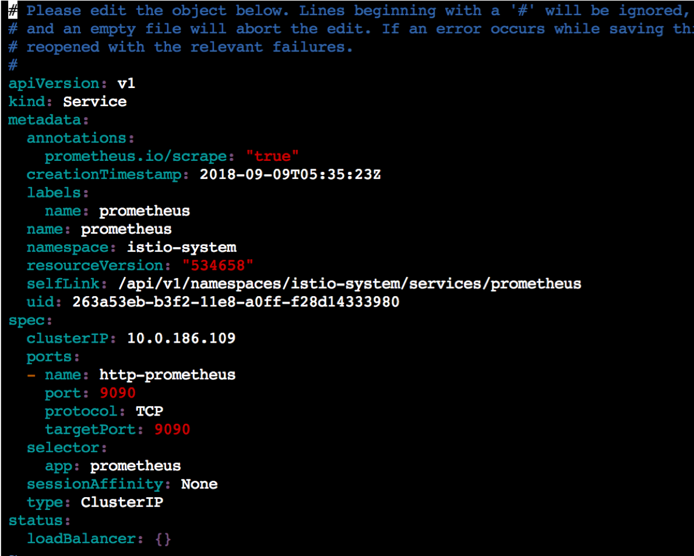

# Istio01: Setup Istio

## Download Istio release package

In this workshop, we use `istio-1.0.2`. Run the following command to download `istio-1.0.2` package

```
$ curl -L https://raw.githubusercontent.com/yokawasa/azure-container-labs/master/scripts/istio-helpers/get-istio | sh -
#   -> istio-1.0.2
```

Once you download the package, change directory to istio-1.0.2
```
cd istio-1.0.2
```

## Install withouth Helm
```
$ kubectl apply -f install/kubernetes/helm/istio/templates/crds.yaml
$ kubectl apply -f install/kubernetes/istio-demo.yaml
```

## Install with Helm

### Configure RBAC for Helm

```
cat helm.yaml

# helm.yaml
apiVersion: v1
kind: ServiceAccount
metadata:
  name: helm
  namespace: kube-system
---
apiVersion: rbac.authorization.k8s.io/v1beta1
kind: ClusterRoleBinding
metadata:
  name: helm
roleRef:
  apiGroup: rbac.authorization.k8s.io
  kind: ClusterRole
  name: cluster-admin
subjects:
  - kind: ServiceAccount
    name: helm
    namespace: kube-system
```

Run the following command
```
$ kubectl apply -f helm.yaml
```


### Install Istio with Helm

To install Istio’s core components, you have options but for a production setup of Istio, it's recommended to install with the Helm Chart, to use all the configuration options. So we use Helm to install Istio - reference: [Install with Helm and Tiller via helm install](https://istio.io/docs/setup/kubernetes/helm-install/#option-2-install-with-helm-and-tiller-via-helm-install).

```
# 1 If a service account has not already been installed for Tiller, install one:
$ kubectl apply -f install/kubernetes/helm/helm-service-account.yaml

# 2. Install Tiller on your cluster with the service account:
$ helm init --service-account tiller

# 3. Install Istio with addons
$ helm install install/kubernetes/helm/istio --name istio --namespace istio-system \
  --set prometheus.enabled=true \
  --set tracing.enabled=true \
  --set servicegraph.enabled=true \
  --set grafana.enabled=true  
```

In this workshop, we use prometheus and grafana for viewing the metrics from Istio, and Jaeger for tracing, and Service graph.
By default, Istio is installed with parameters like `Prometheus:enabled`, `grafana:disabled`, `Jaeger:disabled`,  `servicegraph:disabled`, therefore, these parameters need to be enabled like above. 

Please see [Istio - Installation Options](https://istio.io/docs/reference/config/installation-options/) for more details on what options can be added. 


## Check Pods & Services of Istio

Confrim all pods in `istio-system` namespace are `running`  
```
$ kubectl get pods -n istio-system

NAME                                        READY     STATUS    RESTARTS   AGE
grafana-56d946d5b6-4m5tf                    1/1       Running   0          1d
istio-citadel-769b85bf84-zhj7z              1/1       Running   0          1d
istio-egressgateway-677c95648f-q662v        1/1       Running   0          1d
istio-galley-5c65774d47-tz2nd               1/1       Running   0          1d
istio-ingressgateway-6fd6575b8b-j6fcm       1/1       Running   0          1d
istio-pilot-65f4cfb764-md9dc                2/2       Running   0          1d
istio-policy-5b9945744b-s2nzg               2/2       Running   0          1d
istio-sidecar-injector-75bfd779c9-z8djf     1/1       Running   0          1d
istio-statsd-prom-bridge-7f44bb5ddb-brscl   1/1       Running   0          1d
istio-telemetry-5fc7ccc5b7-ppgrp            2/2       Running   0          1d
istio-tracing-ff94688bb-f56hv               1/1       Running   0          1d
prometheus-84bd4b9796-trrg9                 1/1       Running   0          1d
servicegraph-c44769bc6-z5p9c                1/1       Running   0          1d
```


Get the service list in `istio-system` namespace
```
$ kubectl get svc -n istio-system

NAME                       TYPE           CLUSTER-IP     EXTERNAL-IP      PORT(S)                                                                                                     AGE
grafana                    ClusterIP      10.0.213.140   <none>           3000/TCP                                                                                                    10m
istio-citadel              ClusterIP      10.0.141.145   <none>           8060/TCP,9093/TCP                                                                                           11h
istio-egressgateway        ClusterIP      10.0.209.229   <none>           80/TCP,443/TCP                                                                                              11h
istio-galley               ClusterIP      10.0.105.143   <none>           443/TCP,9093/TCP                                                                                            11h
istio-ingressgateway       LoadBalancer   10.0.165.160   40.115.180.109   80:31380/TCP,443:31390/TCP,31400:31400/TCP,15011:30898/TCP,8060:30247/TCP,15030:30955/TCP,15031:31046/TCP   11h
istio-pilot                ClusterIP      10.0.48.233    <none>           15010/TCP,15011/TCP,8080/TCP,9093/TCP                                                                       11h
istio-policy               ClusterIP      10.0.66.142    <none>           9091/TCP,15004/TCP,9093/TCP                                                                                 11h
istio-sidecar-injector     ClusterIP      10.0.52.142    <none>           443/TCP                                                                                                     11h
istio-statsd-prom-bridge   ClusterIP      10.0.199.206   <none>           9102/TCP,9125/UDP                                                                                           11h
istio-telemetry            ClusterIP      10.0.77.108    <none>           9091/TCP,15004/TCP,9093/TCP,42422/TCP                                                                       11h
jaeger-agent               ClusterIP      None           <none>           5775/UDP,6831/UDP,6832/UDP                                                                                  9m
jaeger-collector           ClusterIP      10.0.207.231   <none>           14267/TCP,14268/TCP                                                                                         9m
jaeger-query               ClusterIP      10.0.179.186   <none>           16686/TCP                                                                                                   9m
prometheus                 ClusterIP      10.0.196.72    <none>           9090/TCP                                                                                                    11h
servicegraph               ClusterIP      10.0.83.19     <none>           8088/TCP                                                                                                    9m
tracing                    ClusterIP      10.0.254.69    <none>           80/TCP                                                                                                      9m
zipkin                     ClusterIP      10.0.181.238   <none>           9411/TCP                                                                                                    9m
```

## Access Istio endpoints (Forwarding local ports to a Pod.)

To port-forward and access `grafana`, run the following commands: 
```
$ kubectl -n istio-system port-forward $(kubectl -n istio-system get pod -l app=grafana \
  -o jsonpath='{.items[0].metadata.name}') 3000:3000

$ curl http://localhost:3000
```

To port-forward and access `prometheus`, run the following commands: 
```
$ kubectl -n istio-system port-forward \
  $(kubectl -n istio-system get pod -l app=prometheus -o jsonpath='{.items[0].metadata.name}') 9090:9090

$ curl http://localhost:9090
```

To port-forward and access `ServiceGraph`, run the follwoing commands:
```
$ kubectl -n istio-system port-forward \
  $(kubectl -n istio-system get pod -l app=servicegraph -o jsonpath='{.items[0].metadata.name}') \
  8088:8088

$ curl http://localhost:8088/dotviz
```

To port-forward and access `Jaeger`, run the follwoing commands:
```
$ kubectl port-forward -n istio-system $(kubectl get pod -n istio-system -l app=jaeger -o jsonpath='{.items[0].metadata.name}') 16686:16686

$ curl http://localhost:16686
```


## Expose and access Istio endpoints (if you can't access the Istio endpoint by forwarding local ports to a Pod)

For example, if you are using `Azure Cloud Shell`, you can not use local portforward to access internal endpoints in Istio, you need to change the service type from `ClusterIP` to `LoadBalancer`. By changing the type to `LoadBalancer`, you can access the endpoint with Global IP. 

Edit the services and change the service type from `ClusterIP` to `LoadBalancer`:

```
# for Prometheus
$ kubectl -n istio-system edit svc prometheus

# for Grafana
$ kubectl -n istio-system edit svc grafana

# for ServiceGraph
$ kubectl -n istio-system edit svc servicegraph

# for Jaeger
$ kubectl -n istio-system edit svc jaeger-query
```




---
[Istio Top](aks-202-istio-top.md)| [Next](istio-02-deploy-bookinfo.md)