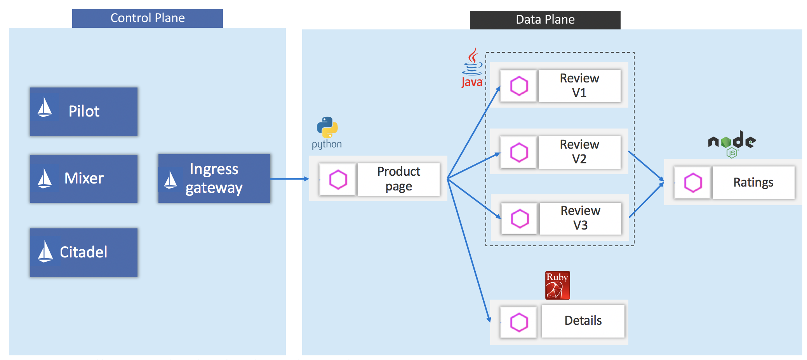

# Istio02: Deploy Sample App - BookInfo

<!-- TOC -->
- [Istio02: Deploy Sample App - BookInfo](#istio02-deploy-sample-app---bookinfo)
  - [Check if your environment support automatic sidecar injection](#check-if-your-environment-support-automatic-sidecar-injection)
  - [Deploy sample app - Bookinfo](#deploy-sample-app---bookinfo)
    - [Option1 - manual sidecar injection.](#option1---manual-sidecar-injection)
    - [Option2 - automatic sidecar injection.](#option2---automatic-sidecar-injection)
  - [Confirm all svc and pods are running](#confirm-all-svc-and-pods-are-running)




## Check if  your environment support automatic sidecar injection

You have 2 ways to inject sidecar: `manual sidecar injection` or `automatic sidecar injection`. 
 Automatic sidecar injection requires that your Kubernetes api-server supports `admissionregistration.k8s.io/v1beta1` or `admissionregistration.k8s.io/v1beta2` APIs. Verify whether your Kubernetes deployment supports these APIs by  executing:

```
$ kubectl api-versions | grep admissionregistration

 admissionregistration.k8s.io/v1alpha1
 admissionregistration.k8s.io/v1beta1
```

If your environment supports these two APIs, then you may use `automatic sidecar injection`. 

> [NOTE]: automatic injection occurs at the pod-level. You won’t see any change to the deployment itself. Instead you’ll want to check individual pods (via `kubectl describe`) to see the injected proxy.

## Deploy sample app - Bookinfo
### Option1 - manual sidecar injection.
To create Data Plane, you can deploy `Sidecar` like this
```
$ kubectl apply -f <(istioctl kube-inject -f samples/bookinfo/platform/kube/bookinfo.yaml)
# <another way>
# $ istioctl kube-inject -f samples/bookinfo/platform/kube/bookinfo.yaml | kubectl apply -f -

service "details" created
deployment "details-v1" created
service "ratings" created
deployment "ratings-v1" created
service "reviews" created
deployment "reviews-v1" created
deployment "reviews-v2" created
deployment "reviews-v3" created
service "productpage" created
deployment "productpage-v1" created
```

### Option2 - automatic  sidecar injection.
If you are using a cluster with automatic sidecar injection enabled, you can automatically deploy Envoy proxy as `Sidecar` to Pods in specific namespace. Here you configure to enable automatic sidecar injection in `default` namespace by labeling `default` namespace with `istio-injection=enabled`

```
$ kubectl label namespace default istio-injection=enabled
```

Then simply deploy the services using kubectl
```
$ kubectl apply -f samples/bookinfo/platform/kube/bookinfo.yaml

service "details" created
deployment "details-v1" created
service "ratings" created
deployment "ratings-v1" created
service "reviews" created
deployment "reviews-v1" created
deployment "reviews-v2" created
deployment "reviews-v3" created
service "productpage" created
deployment "productpage-v1" created
```

## Confirm all svc and pods are running

Get service lists:
```
$ kubectl get svc

NAME                 TYPE           CLUSTER-IP     EXTERNAL-IP    PORT(S)        AGE
details              ClusterIP      10.0.208.13    <none>         9080/TCP       2m
kubernetes           ClusterIP      10.0.0.1       <none>         443/TCP        13d
party-clippy         ClusterIP      10.0.29.167    <none>         80/TCP         3d
productpage          ClusterIP      10.0.139.249   <none>         9080/TCP       2m
ratings              ClusterIP      10.0.3.187     <none>         9080/TCP       2m
reviews              ClusterIP      10.0.39.59     <none>         9080/TCP       2m
```

Check if all Pods' STATUS are `running`
```
$ kubectl get pods

NAME                                  READY     STATUS    RESTARTS   AGE
details-v1-596775d474-kmf5x           2/2       Running   0          2m
productpage-v1-6c78bf6fb6-4ml55       2/2       Running   0          2m
ratings-v1-6b794b4db6-lfjq8           2/2       Running   0          2m
reviews-v1-7cffb56b4d-6v25n           2/2       Running   0          2m
reviews-v2-869dcbf5c4-rvmhd           2/2       Running   0          2m
reviews-v3-75c98fbc6-78m9k            2/2       Running   0          2m
```


---
[Istio Top](aks-202-istio-top.md)| [Back](istio-01-setup.md) | [Next](istio-03-ingress-gateway.md)
