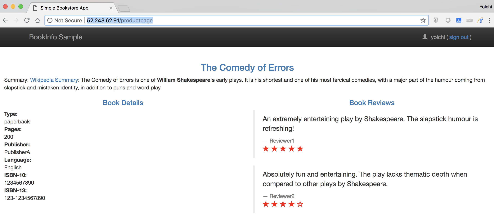

# Module Istio03: Expose BookInfo via Istio Ingress Gateway

You need to make the application accessible from outside of your Kubernetes cluster. An ingress gateway service is deployed as a LoadBalancer service. For making Bookinfo accessible from outside, we have to create an Istio Gateway. 

## Create IngressGateway for the Bookinfo app

First of all, create the ingress gateway for the application:
```
$ kubectl apply -f samples/bookinfo/networking/bookinfo-gateway.yaml
```

Then, confirm the gateway has been created:
```
$ kubectl get gateway

NAME               AGE
bookinfo-gateway   1m
```

## Get Gateway URL and access the gateway

You can obtain the gateway URL like this: 
```
export INGRESS_HOST=$(kubectl -n istio-system get service istio-ingressgateway -o jsonpath='{.status.loadBalancer.ingress[0].ip}')

export INGRESS_PORT=$(kubectl -n istio-system get service istio-ingressgateway -o jsonpath='{.spec.ports[?(@.name=="http2")].port}')

export GATEWAY_URL=$INGRESS_HOST:$INGRESS_PORT

echo $GATEWAY_URL
```

Or you can simply get the gateway url from `istio-ingressgateway` service's YAML output (just pick `loadBalancer` igress IP and port of `http2` )
```
$ kubectl get svc istio-ingressgateway  -n istio-system -o yaml

apiVersion: v1
kind: Service
metadata:
  creationTimestamp: 2018-09-09T05:35:23Z
  labels:
    app: istio-ingressgateway
    chart: gateways-1.0.1
    heritage: Tiller
    istio: ingressgateway
    release: istio
  name: istio-ingressgateway
  namespace: istio-system
  resourceVersion: "535065"
  selfLink: /api/v1/namespaces/istio-system/services/istio-ingressgateway
  uid: 26168091-b3f2-11e8-a0ff-f28d14333980
spec:
  clusterIP: 10.0.248.15
  externalTrafficPolicy: Cluster
  ports:
  - name: http2
    nodePort: 31380
    port: 80
    protocol: TCP
    targetPort: 80
  - name: https
    nodePort: 31390
    port: 443
    protocol: TCP
    targetPort: 443
  - name: tcp
    nodePort: 31400
    port: 31400
    protocol: TCP
    targetPort: 31400
  - name: tcp-pilot-grpc-tls
    nodePort: 32538
    port: 15011
    protocol: TCP
    targetPort: 15011
  - name: tcp-citadel-grpc-tls
    nodePort: 30105
    port: 8060
    protocol: TCP
    targetPort: 8060
  - name: tcp-dns-tls
    nodePort: 32090
    port: 853
    protocol: TCP
    targetPort: 853
  - name: http2-prometheus
    nodePort: 32193
    port: 15030
    protocol: TCP
    targetPort: 15030
  - name: http2-grafana
    nodePort: 30745
    port: 15031
    protocol: TCP
    targetPort: 15031
  selector:
    app: istio-ingressgateway
    istio: ingressgateway
  sessionAffinity: None
  type: LoadBalancer
status:
  loadBalancer:
    ingress:
    - ip: 52.243.62.91
```

Then, access the productpage of Bookinfo app:
```
curl -o /dev/null -s -w "%{http_code}\n" http://${GATEWAY_URL}/productpage
```

It's OK if you get `200` status code




---
[Istio Top](aks-202-istio-top.md)| [Back](istio-02-deploy-bookinfo.md) | [Next](istio-04-telemetry.md)