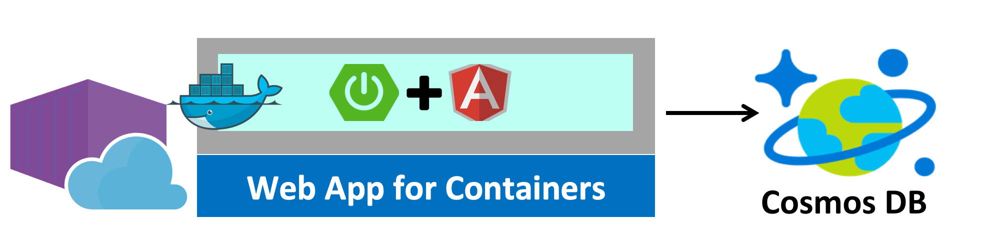

# Web App for Containers Labs: Spring Boot app + CosmosDB

# Todo App (SprintBoot)

<!-- TOC -->

- [Web App for Containers Labs: Spring Boot app + CosmosDB](#web-app-for-containers-labs-spring-boot-app--cosmosdb)
- [Todo App (SprintBoot)](#todo-app-sprintboot)
    - [1. Preps](#1-preps)
        - [Azure Cloud Shell](#azure-cloud-shell)
        - [Labs materials](#labs-materials)
        - [env.sh - Environment variables file](#envsh---environment-variables-file)
    - [2. Create Azure resources](#2-create-azure-resources)
        - [Azure resource group for the labs](#azure-resource-group-for-the-labs)
        - [Cosmos DB](#cosmos-db)
        - [Azure Container Registry (ACR)](#azure-container-registry-acr)
        - [App Service Plan](#app-service-plan)
        - [Service Principal](#service-principal)
    - [3. Setup basic configuration files](#3-setup-basic-configuration-files)
        - [Add CosmosDB info in env.sh](#add-cosmosdb-info-in-envsh)
        - [settings.xml - Maven user setting file](#settingsxml---maven-user-setting-file)
    - [4. Build package and run locally](#4-build-package-and-run-locally)
        - [Build package and run locally using mvn](#build-package-and-run-locally-using-mvn)
        - [[Alternative] Build container image and run locally using docker](#alternative-build-container-image-and-run-locally-using-docker)
    - [5. Push the container image to ACR](#5-push-the-container-image-to-acr)
        - [Push the image to ACR using mvn](#push-the-image-to-acr-using-mvn)
        - [[Alternative] Push the image to ACR using docker command](#alternative-push-the-image-to-acr-using-docker-command)
    - [6. Deploy the App to Web App for Containers](#6-deploy-the-app-to-web-app-for-containers)
        - [Deploy the app to Azure using mvn](#deploy-the-app-to-azure-using-mvn)
        - [[Alternative] Deploy the app to Azure using Azure CLI command](#alternative-deploy-the-app-to-azure-using-azure-cli-command)
    - [7. Continuous Deployment](#7-continuous-deployment)
        - [Enable built-in CD feature for custom Docker images](#enable-built-in-cd-feature-for-custom-docker-images)
        - [CD for custom Docker images using CD tools](#cd-for-custom-docker-images-using-cd-tools)
    - [8. Other Features](#8-other-features)
        - [Deployment Slot](#deployment-slot)
        - [Enabling Docker Container logging](#enabling-docker-container-logging)
        - [Use Application Insights in a Java web project](#use-application-insights-in-a-java-web-project)
        - [Scale Out](#scale-out)
        - [Custom Domain](#custom-domain)
        - [Security Configurations](#security-configurations)
    - [LINKS](#links)

<!-- /TOC -->




## 1. Preps

### Azure Cloud Shell
In this labs, you're running this workthrough on [Azure Cloud Shell Bash](https://docs.microsoft.com/en-us/azure/cloud-shell/overview). For a user who haven't used Azure Cloud Shell, please check 'Open Azure Cloud Shell' and 'Verify Subscription' section in [the module](ks-100-setup-env.md).

### Labs materials
Get labs materials from Github
```
git clone https://github.com/yokawasa/azure-container-labs.git
cd azure-container-labs/apps/todo
```

### env.sh - Environment variables file
Open `env.sh` file, add values for each variable except `COSMOSDB_URI`, `COSMOSDB_KEY`, and `COSMOSDB_DBNAME`

> env.sh
```bash
# CosmosDB Configuration
export COSMOSDB_NAME=<put-your-COSMOS-DB-name-here>
export COSMOSDB_URI=<SKIP THIS NOW>
export COSMOSDB_KEY=<SKIP THIS NOW>
export COSMOSDB_DBNAME=<SKIP THIS NOW>

# Web App for Containers Configuration
export RESOURCE_GROUP=<put-your-resource-group-name-here>
export WEBAPP_NAME=<put-your-Webapp-name-here>
export REGION=<put-your-REGION-here>
export APP_SERVICE_PLAN_NAME=<put-your-app-service-plan-name>

# Azure Container Registry Configuration
export ACR_NAME=<put-your-acr-name>
```

Read them into environmental variables
```bash
source env.sh
```

## 2. Create Azure resources
You need to create a couple of Azure resources for this labs

### Azure resource group for the labs
```bash
az group create --name $RESOURCE_GROUP --location $REGION
```

### Cosmos DB
Create Cosmos DB Instances and get CosmosDB key using Azure CLI command

```bash
# Create Azure Cosmos DB with DocumentDB kind
az cosmosdb create --kind GlobalDocumentDB -g $RESOURCE_GROUP -n $COSMOSDB_NAME

# Get your Azure Cosmos DB key, get the primaryMasterKey of the DocumentDB you just created.
az cosmosdb list-keys -g $RESOURCE_GROUP -n $COSMOSDB_NAME
```

### Azure Container Registry (ACR)

Create Azure Container Registry (ACR) and enable ACR admin user using Azure CLI command
```bash
# Create an Azure Container Registry
az acr create -g $RESOURCE_GROUP -n $ACR_NAME --sku Basic

# Get the registry's login server
az acr show -n $ACR_NAME --query "{acrLoginServer:loginServer}" -o table
# AcrLoginServer
# -------------------------
# yoichikaacr001.azurecr.io

# Enable the admin user for an existing registry
az acr update -n $ACR_NAME --admin-enabled true

# Show credential of ACR admin user
az acr credential show -n $ACR_NAME -o table
# USERNAME        PASSWORD                          PASSWORD2
# -------------  --------------------------------  --------------------------------
#yoichikaacr001  rZjZMzOLKg2fTzQg3=d6D0UUe7whY3S0  CT27TDJChkLz9yTE1qs/XXsRiIyWi3NA
```

### App Service Plan

Create an App Service Plan (Linux Plan) to which you'll create your web app using Azure CLI command

```bash
az appservice plan create \
  -n $APP_SERVICE_PLAN_NAME \
  -g $RESOURCE_GROUP \
  --is-linux \
  -l $REGION \
  --sku S1 \
  --number-of-workers 1
```

### Service Principal

Create an Azure service principal using azure CLI command

```bash
# az ad sp create-for-rbac --name "<display name of service principal>"
az ad sp create-for-rbac --name "sp-webappcon-java"
```
> Output
```
{
  "appId": "********-a4c9-4490-9a09-7dd3bab43520",
  "displayName": "sp-webappcon-java",
  "name": "http://sp-webappcon-java",
  "password": "********-d882-4b6f-9218-191dc8935fca",
  "tenant": "********-86f1-41af-91ab-2d7cd011db47"
}
```

Please take note of the values of `appId`, `password`, and `tenant` from this JSON response. You will use them in configuring the Maven plugin to deploy your container to Azure.

## 3. Setup basic configuration files

Let's see directory tree under `apps/todo` dir. This is base dir for the labs
```
$ tree
.
├── Dockerfile
├── LICENSE
├── README.md
├── checkstyle.xml
├── env.sh
├── env.sh.sample
├── pom.xml
├── settings.xml.sample
└── src
    ├── main
    │   ├── java
    │   │   └── com
    │   │       └── microsoft
    │   │           └── azure
    │   │               └── sample
    │   │                   ├── TodoApplication.java
    │   │                   ├── controller
    │   │                   │   └── TodoListController.java
    │   │                   ├── dao
    │   │                   │   └── TodoItemRepository.java
    │   │                   └── model
    │   │                       └── TodoItem.java
    │   └── resources
    │       ├── application.properties
    │       └── static
    │           ├── Scripts
    │           │   ├── app.js
    │           │   ├── homeCtrl.js
    │           │   ├── todoListCtrl.js
    │           │   └── todoListSvc.js
    │           ├── Views
    │           │   ├── Home.html
    │           │   └── TodoList.html
    │           └── index.html
    └── test
        ├── java
        │   └── com
        │       └── microsoft
        │           └── azure
        │               └── sample
        │                   ├── TodoApplicationTest.java
        │                   └── model
        │                       └── TodoItemTest.java
        └── resources
            └── test.properties
```

### Add CosmosDB info in env.sh

Open `env.sh` file, add values for `COSMOSDB_URI`, `COSMOSDB_KEY`, and `COSMOSDB_DBNAME`

> env.sh
```bash
# CosmosDB Configuration
export COSMOSDB_URI=<put-your-COSMOS-DB-documentEndpoint-URI-here>
export COSMOSDB_KEY=<put-your-COSMOS-DB-primaryMasterKey-here>
export COSMOSDB_DBNAME=<put-your-COSMOS-DB-name-here>
```

Read them again into environmental variables
```bash
source env.sh
```

FYI, these environment variables are used in `application.properties` in the TODO list app, and in `pom.xml`, a model file for this maven project

> src/main/resources/application.properties
```
azure.cosmosdb.uri=${COSMOSDB_URI}
azure.cosmosdb.key=${COSMOSDB_KEY}
azure.cosmosdb.database=${COSMOSDB_DBNAME}
```
> NOTE: You can put variables in the propertie file and set their values in system environment variables: `COSMOSDB_URI`, `COSMOSDB_KEY` and `COSMOSDB_DBNAME`. Then maven will substitute them during the build phase.

> pom.xml
```xml

<properties>
    ...
    <!-- configurable properties                                             -->
    <!-- azure.containerRegistry: the name of your Azure container registry  -->
    <!-- docker.image.prefix: the URL of your  Azure container registry      -->
    <azure.app.name>todo-app-${maven.build.timestamp}</azure.app.name>
    <azure.containerRegistry>${ACR_NAME}</azure.containerRegistry>
    <docker.image.prefix>${azure.containerRegistry}.azurecr.io</docker.image.prefix>

</properties>

<build>
    <plugins>
    ...
        <!--*************************************************-->
        <!-- Azure Web App Plugin for Maven                  -->
        <!-- for deploying to Azure Web App for Containers   -->
        <!--*************************************************-->
        <plugin>
            <groupId>com.microsoft.azure</groupId>
            <artifactId>azure-webapp-maven-plugin</artifactId>
            <version>${plugin.azure.webapp.version}</version>
            <configuration>
                <resourceGroup>${RESOURCE_GROUP}</resourceGroup>
                <!-- <appName>${azure.app.name}</appName> -->
                <appName>${WEBAPP_NAME}</appName>
                <region>${REGION}</region>
                <pricingTier>s1</pricingTier>
                <containerSettings>
                    <!-- <imageName>${docker.image.prefix}/${project.artifactId}:latest</imageName> -->
                    <imageName>${docker.image.prefix}/${project.artifactId}:${project.version}</imageName>
                    <registryUrl>https://${docker.image.prefix}</registryUrl>
                    <serverId>${azure.containerRegistry}</serverId>
                </containerSettings>
                <appSettings>
                    <property>
                        <name>COSMOSDB_URI</name>
                        <value>${COSMOSDB_URI}</value>
                    </property>
                    <property>
                        <name>COSMOSDB_KEY</name>
                        <value>${COSMOSDB_KEY}</value>
                    </property>
                    <property>
                        <name>COSMOSDB_DBNAME</name>
                        <value>${COSMOSDB_DBNAME}</value>
                    </property>
                </appSettings>
            </configuration>
        </plugin>

    ...
    </plugins>
</build>
```

### settings.xml - Maven user setting file

Add your ACR access info and Service principal info to your Maven user setting file `settings.xml`
> [NOTE] possible settings.xml location would be like:
> - `/etc/maven/settings.xml`
> - `$HOME/.m2/settings.xml`
> Please see https://maven.apache.org/settings.html


> $HOME/.m2/settings.xml
```xml
  <servers>
    <!-- Your Azure Container Registry access settings  -->
    <!-- id: The name of Azure container registry       -->
    <!-- username: user name of your ACR                -->
    <!-- password: password of your ACR                 -->
    <server>
      <id>yoichikaacr001</id>
      <username>yoichikaacr001</username>
      <password>rZjZMzOLKg2fTzQg3=************</password>
      <configuration>
        <email>foo@foo.bar</email>
      </configuration>
    </server>
    <!-- Your Azure service principal settings          -->
    <!-- id: A unique name for your security setting    -->
    <!--     for deploying your app to Azure web app    -->
    <!-- client:  the appId of your service principal   -->
    <!-- tenant:  the tenant of your service principal  -->
    <!-- key: the password of your service principal    -->
    <server>
      <id>azure-auth</id>
      <configuration>
        <client>********-a4c8-4490-9a09-7dd3bab43520</client>
        <tenant>********-86fs-41af-91ab-2d7cd011db47</tenant>
        <key>********-d882-4b8f-9218-191dc8935fca</key>
        <environment>AZURE</environment>
      </configuration>
    </server>
  </servers>
```

## 4. Build package and run locally

### Build package and run locally using mvn

First, package the project using mvn
```bash
mvn clean package
```
Then, run the project with this mvn command
```bash
mvn spring-boot:run
```
> NOTE: you can also run the project by directly using java command like this
>```bash
>java -jar target/todo-app-java-on-azure-1.0-SNAPSHOT.jar
>```

Finally, open http://localhost:8080, you'll be able to see the web pages to show the todo list app
```bash
open http://localhost:8080
```

### [Alternative] Build container image and run locally using docker

As an alternative way for running the app locally, you can run it as a container app with docker. Suppose you've already build the package using mvn, build a container image for the project and run locally using docker like this: 

Here is an example docker command:
```bash
IMAGE_TAG=1.0-SNAPSHOT

# Docker build
docker build -t todo-app-java:$IMAGE_TAG .

# Docker run
docker run \
  -e COSMOSDB_URI=$COSMOSDB_URI \
  -e COSMOSDB_KEY=$COSMOSDB_KEY \
  -e COSMOSDB_DBNAME="$COSMOSDB_DBNAME" \
  -it --rm -p 8080:80 \
  todo-app-java:$IMAGE_TAG

# Test access
open http://localhost:8080
```

## 5. Push the container image to ACR 

### Push the image to ACR using mvn

```bash
# Build an image
mvn clean package docker:build

# Build an image and push it to the registry
mvn clean package docker:build -DpushImage

# Simply push the image you just built to the registry
mvn docker:build -DpushImage
```

Once you push the image, you can check the repository with `az acr repository` command 
```bash
# Show list of repositories
az acr repository list -n $ACR_NAME -o table
# Show list of tags in a repository
az acr repository show-tags -n $ACR_NAME --repository $REPO_NAME -o table
```

### [Alternative] Push the image to ACR using docker command

As an alternative way for pushiing the image to ACR, you can do with docker command like this:

```bash
IMAGE_TAG=1.0-SNAPSHOT

# Docker login to ACR Login Server using username and password
docker login $ACR_NAME.azurecr.io -u <USERNAME>

# Push the images
# here is an example of pushing an image that has specific image tag, and the one with latest tag
docker tag todo-app-java:$IMAGE_TAG $ACR_NAME.azurecr.io/todo-app-java:latest
docker tag todo-app-java:$IMAGE_TAG $ACR_NAME.azurecr.io/todo-app-java:$IMAGE_TAG
docker push $ACR_NAME.azurecr.io/todo-app-java:$IMAGE_TAG
docker push $ACR_NAME.azurecr.io/todo-app-java:latest
```

## 6. Deploy the App to Web App for Containers

### Deploy the app to Azure using mvn

[azure-maven-plugin](https://github.com/microsoft/azure-maven-plugins) allows you to deploy the app to Azure with a very simple command like this:

```bash
mvn azure-webapp:deploy
```

If a target web app doesn't exist, the plugin create a new web app with the following message:
```
[INFO] Target Web App doesn't exist. Creating a new one...
[INFO] Successfully created Web A
[INFO] No resources specified in pom.xml. Skip artifacts deployment.
[INFO] Successfully deployed Web App at https://todo-app-190702110612612.azurewebsites.net
```

### [Alternative] Deploy the app to Azure using Azure CLI command

As an alternative way for the deployment, you can deploy the app to Azure directly using Azure CLI command like this:

```bash
# Create a web app
az webapp create \
  -n $WEB_APP_NAME \
  -g $RESOURCE_GROUP \
  -p $APP_SERVICE_PLAN_NAME \
  -i $ACR_NAME.azurecr.io/todo-app-java:latest

# Configure web app with a custom Docker Container from Azure Container Registry.
az webapp config container set \
  -g $RESOURCE_GROUP \
  -n $WEB_APP_NAME \
  --docker-registry-server-url https://$ACR_NAME.azurecr.io
```
> NOTE: if you're deploying the container image from private registry, you need to add credential info for the registry using `--docker-registry-server-user` and `--docker-registry-server-password` like this:
> ```
>az webapp config container set \
>  --resource-group $RESOURCE_GROUP \
>  --name $WEB_APP_NAME \
>  --docker-registry-server-url https://<registry-url> \
>  --docker-registry-server-user <registry_user> \
>  --docker-registry-server-password <registry_password>
> ```


## 7. Continuous Deployment

### Enable built-in CD feature for custom Docker images

You can enable a built-in continuous deployment for custom docker images in Azure Portal. If the repository is Azure Container Registry (ACR), a webhook to trigger the CD is automatically created on the ACR. Please see the following page:
- [Continuous deployment with Web App for Containers](https://docs.microsoft.com/en-us/azure/app-service/containers/app-service-linux-ci-cd)

You can use Azure CLI command for this but currently it may have an issue (See issue: [Enabling CD for custom Docker images with Azure CLI command does not create a webhook on relevant ACR](https://github.com/MicrosoftDocs/azure-docs/issues/34240))
```bash
az webapp deployment container config \
  -n $WEB_APP_NAME \
  -g $RESOURCE_GROUP \
  -e true
```

### CD for custom Docker images using CD tools
- https://docs.microsoft.com/en-us/azure/devops/pipelines/apps/cd/deploy-docker-webapp

## 8. Other Features
### Deployment Slot
- [Set up staging environments in Azure App Service](https://docs.microsoft.com/en-us/azure/app-service/deploy-staging-slots)
### Enabling Docker Container logging

Docker container logging is not enabled by default. You can enable with the following Azure CLI Command or in Azure Portal
```bash
az webapp log config -n $WEB_APP_NAME -g $RESOURCE_GROUP \
  --web-server-logging filesystem
```

Once this is done, you can then tail the log live from the cloud:
```bash
az webapp log tail -n $WEB_APP_NAME -g $RESOURCE_GROUP
```

Here is how you enable the logging in Azure Portal. See also


Also, you can inspect the log files from the browser at
> `https://<app-name>.scm.azurewebsites.net/api/logs/docker`

### Use Application Insights in a Java web project 
- [Get started with Application Insights in a Java web project]( https://docs.microsoft.com/en-us/azure/azure-monitor/app/java-get-started)
- https://github.com/microsoft/ApplicationInsights-Java
- [Configure a Spring Boot Initializer app to use Application Insights](https://docs.microsoft.com/en-us/java/azure/spring-framework/configure-spring-boot-java-applicationinsights?view=azure-java-stable)

### Scale Out
- [Get started with Autoscale in Azure](https://docs.microsoft.com/en-us/azure/azure-monitor/platform/autoscale-get-started)

You can manually scale out:
```bash
az appservice plan update --number-of-workers 2 \
   --name ${WEBAPP_PLAN_NAME} \
   --resource-group <your-azure-group-name>
```

### Custom Domain
- [Map an existing custom DNS name to Azure App Service](https://docs.microsoft.com/en-us/azure/app-service/app-service-web-tutorial-custom-domain)

### Security Configurations
- [Buy and configure an SSL certificate for Azure App Service](https://docs.microsoft.com/en-us/azure/app-service/web-sites-purchase-ssl-web-site)
- [https://docs.microsoft.com/en-us/azure/app-service/overview-inbound-outbound-ips](https://docs.microsoft.com/en-us/azure/app-service/overview-inbound-outbound-ips)
- [Integrate your app with an Azure Virtual Network](https://docs.microsoft.com/en-us/azure/app-service/web-sites-integrate-with-vnet)

## LINKS
- [Azure CLI Commands samples for Azure App Services](https://docs.microsoft.com/en-us/azure/app-service/samples-cli)
- [Azure CLI Commands for Managing Web App for Containers](https://docs.microsoft.com/en-us/azure/app-service/containers/app-service-linux-cli)
- [Azure CLI Commands for Managing Azure Container Registry](https://docs.microsoft.com/en-us/cli/azure/acr?view=azure-cli-latest)
- [Azure App Service on Linux FAQ](https://docs.microsoft.com/en-us/azure/app-service/containers/app-service-linux-faq)
- [docker-maven-plugin](https://github.com/spotify/docker-maven-plugin)
- [azure-maven-plugin](https://github.com/microsoft/azure-maven-plugins)
- https://github.com/microsoft/spring-data-cosmosdb
- [How to use the Spring Boot Starter with the Azure Cosmos DB SQL API](https://docs.microsoft.com/en-us/java/azure/spring-framework/configure-spring-boot-starter-java-app-with-cosmos-db)
- [java-jdk-docker-images](https://docs.microsoft.com/en-us/java/azure/jdk/java-jdk-docker-images)
