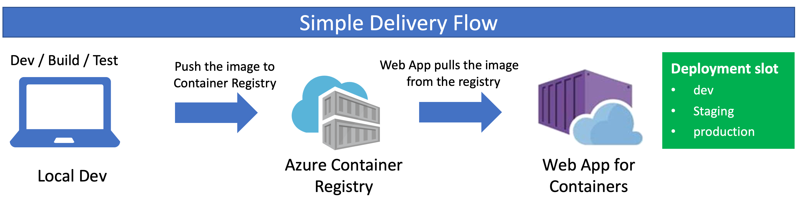
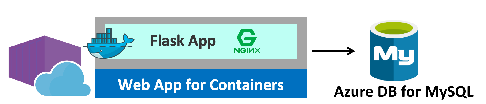

# Web App for Containers Labs: Voting App (Python Flask + MySQL)

<!-- TOC -->

- [Web App for Containers Labs: Voting App (Python Flask + MySQL)](#web-app-for-containers-labs-voting-app-python-flask--mysql)
    - [1. Setup Azure Database for MySQL](#1-setup-azure-database-for-mysql)
        - [Create Azure Database for MySQL](#create-azure-database-for-mysql)
        - [Firewall - Allow from All](#firewall---allow-from-all)
        - [SSL enforcement disable](#ssl-enforcement-disable)
        - [Confirm Access](#confirm-access)
        - [Create Database 'azurevote' on Azure MySQL (Azure Database for MySQL)](#create-database-azurevote-on-azure-mysql-azure-database-for-mysql)
    - [2. Build and push Docker image to Container Registery](#2-build-and-push-docker-image-to-container-registery)
        - [Create Azure Container Registry instance](#create-azure-container-registry-instance)
        - [Build Containers from Dockerfiles using ACR Build and host the images in ACR](#build-containers-from-dockerfiles-using-acr-build-and-host-the-images-in-acr)
            - [Clone the workshop repo into the cloud shell environment](#clone-the-workshop-repo-into-the-cloud-shell-environment)
            - [Build azure-vote-front container](#build-azure-vote-front-container)
            - [Check your repositories in ACR](#check-your-repositories-in-acr)
    - [3. Setup Web App and deploy the application to Web App](#3-setup-web-app-and-deploy-the-application-to-web-app)
        - [Create Resource Group for App Service Plan (if needed)](#create-resource-group-for-app-service-plan-if-needed)
        - [Create App Service Plan (If it's App Service Plan instead of Consumption Plan)](#create-app-service-plan-if-its-app-service-plan-instead-of-consumption-plan)
        - [Create Web App for Container](#create-web-app-for-container)
        - [Configure App Settings for accessing MySQL](#configure-app-settings-for-accessing-mysql)
    - [Useful Links](#useful-links)

<!-- /TOC -->






## 1. Setup Azure Database for MySQL

```sh
RESOURCE_GROUP="Resource Group Name"
AZURE_DB_ACCOUNT_NAME="Azure Database Account Name"
MYSQL_ADMIN_USER="DB Admin User Name"
MYSQL_ADMIN_PASSWORD="DB Admin User Name"
AZURE_DB_SKU="B_Gen4_1"             # tier_family_cores
LOCATION="Azure Region"             # ie. japaneast etc
```

### Create Azure Database for MySQL
```sh
az mysql server create \
    --resource-group $RESOURCE_GROUP \
    --name $AZURE_DB_ACCOUNT_NAME \
    --admin-user $MYSQL_ADMIN_USER \
    --admin-password $MYSQL_ADMIN_PASSWORD \
    --sku-name $AZURE_DB_SKU \
    --location $LOCATION
```

### Firewall - Allow from All
```sh
az mysql server firewall-rule create \
    -g $RESOURCE_GROUP \
    -s $AZURE_DB_ACCOUNT_NAME \
    --name AllowFullRangeIP \
    --start-ip-address 0.0.0.0 --end-ip-address 0.0.0.0
```
### SSL enforcement disable
```sh
az mysql server update \
    -g $RESOURCE_GROUP \
    -n $AZURE_DB_ACCOUNT_NAME \
    --ssl-enforcement Disabled
```

### Confirm Access
```sh
mysqladmin -u $MYSQL_ADMIN_USER@$AZURE_DB_ACCOUNT_NAME -p$MYSQL_ADMIN_PASSWORD -h $AZURE_DB_ACCOUNT_NAME.mysql.database.azure.com ping
```

### Create Database 'azurevote' on Azure MySQL (Azure Database for MySQL)
```sh
echo "CREATE TABLE azurevote.azurevote (voteid INT NOT NULL AUTO_INCREMENT,votevalue VARCHAR(45) NULL,PRIMARY KEY (voteid));" \
    | mysql -u $MYSQL_ADMIN_USER@$AZURE_DB_ACCOUNT_NAME -p$MYSQL_ADMIN_PASSWORD -h $AZURE_DB_ACCOUNT_NAME.mysql.database.azure.com
```


## 2. Build and push Docker image to Container Registery

In this section, you will use Azure Container Registry (ACR) to build containers from Dockerfiles and also host your images to run in Web App for Containers.


### Create Azure Container Registry instance

```sh
ACR_NAME="myazconacr"   # Your Registry Name
az acr create --resource-group $RESOURCE_GROUP --name $ACR_NAME --sku Standard
```
> - Resource Group: Use the existing Resource Group that you created in previous module
> - SKU Options: `Basic`, `Standard`(default), `Premium`: The Standard registry offers the same capabilities as Basic, but with increased storage limits and image throughput. Standard registries should satisfy the needs of most production scenarios.

### Build Containers from Dockerfiles using ACR Build and host the images in ACR

#### Clone the workshop repo into the cloud shell environment

Clone the workshop repo
```sh
$ git clone https://github.com/yokawasa/azure-container-labs.git
```

Then, change directory to the repository

```
$ cd azure-container-labs
$ ls

apps  assets  charts  kubernetes-manifests  labs  LICENSE  README.md  scripts
```

#### Build azure-vote-front container
```sh
ACR_NAME="myazconacr"   # Registry Name
cd azure-container-labs/apps/vote/azure-vote
az acr build --registry $ACR_NAME --image azure-vote-front:1.0.0 .
```

#### Check your repositories in ACR

```
$ az acr repository list -n $ACR_NAME -o table

Result
----------------
azure-vote-front
```

```
$  az acr repository show -n $ACR_NAME --repository azure-vote-front -o table

CreatedTime                   ImageName         LastUpdateTime                ManifestCount    Registry               TagCount
----------------------------  ----------------  ----------------------------  ---------------  ---------------------  ----------
2018-09-20T02:03:33.3498203Z  azure-vote-front  2018-09-20T02:03:33.4005353Z  1                myazconacr.azurecr.io  1
```

## 3. Setup Web App and deploy the application to Web App

```sh
RESOURCE_GROUP="Resource Group Name"
APP_NAME="Web App Name"
APP_SERVICE_PLAN="App Service Plan Name"
APP_SERVICE_PLAN_SKU="S1"
CONTAINER_IMAGE=<REGISTRY_URL>/<CONTAINER_IMAGE:TAG>

MYSQL_USER="<mysqluser>@<azuremysqlaccount>"
MYSQL_PASSWORD="<password>"
MYSQL_DATABASE="azurevote"  # fixed
MYSQL_HOST="<azuremysqlaccount>.mysql.database.azure.com"
```

### Create Resource Group for App Service Plan (if needed)
```sh
az group create --name $RESOURCE_GROUP --location $LOCATION
```

### Create App Service Plan (If it's App Service Plan instead of Consumption Plan)
```
az appservice plan create \
 --name $APP_SERVICE_PLAN \
 --resource-group $RESOURCE_GROUP \
 --sku $APP_SERVICE_PLAN_SKU --is-linux
```
> [NOTE] Plan with Linux worker can only be created in a group which has never contained a Windows worker, and vice versa.

### Create Web App for Container
```sh
az webapp create \
  --name $APP_NAME \
  --resource-group $RESOURCE_GROUP \
  --plan $APP_SERVICE_PLAN \
  --deployment-container-image-name $CONTAINER_IMAGE
```

### Configure App Settings for accessing MySQL
```sh
az webapp config appsettings set \
  -n $APP_NAME \
  -g $RESOURCE_GROUP \
  --settings \
    MYSQL_USER=$MYSQL_USER \
    MYSQL_PASSWORD=$MYSQL_PASSWORD \
    MYSQL_DATABASE=$MYSQL_DATABASE \
    MYSQL_HOST=$MYSQL_HOST
```


## Useful Links
- https://docs.microsoft.com/en-us/azure/container-registry/container-registry-tutorial-quick-build
- https://docs.microsoft.com/en-us/cli/azure/acr?view=azure-cli-latest
